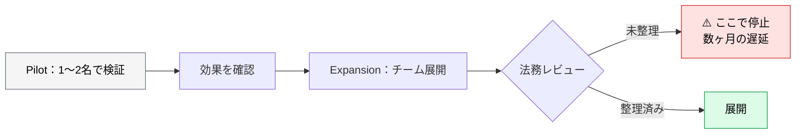
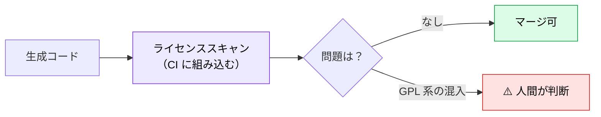

# AI 利用ポリシー・法務・ライセンス

> **この記事でわかること**：エンタープライズ導入で**法務が最初に止める3つの論点**と、稟議を通すための整理。

> **⚠️ 本記事は法的助言ではない。** エンジニアが論点を整理するためのものであり、**最終的な判断は自社の法務部門・顧問弁護士による**。本記事の分類や例をそのまま社内基準として適用しない。

## 結論

技術的な準備が整っていても、**ここで止まる**。

> **エンタープライズ導入では、法務・情報システム部門が最初に確認するのは技術ではなく契約と権利である。**

論点は3つに集約される。

| # | 論点 | 質問される形 |
| --- | --- | --- |
| **1** | **入力してよいデータの区分** | 「顧客データを AI に入れていいのか？」 |
| **2** | **顧客契約上の AI 利用可否** | 「受託案件で AI を使ってよいと契約に書いてあるか？」 |
| **3** | **生成コードのライセンス** | 「OSS ライセンスが混入していないか？」 |

**導入ロードマップの Day 1-30 に入れる。** 後回しにすると、展開の直前で止まる。

## 背景・課題

「まず試してみよう」で始めると、Pilot は通る。しかし **Expansion で法務レビューに入った瞬間に止まる**。



**Pilot と並行して法務の確認を進める**のが、最も時間を無駄にしない進め方である。

## 具体的な方法

### 論点1：入力してよいデータの区分

**最初に決めるべきはこれである。** 曖昧なまま使うと、事故は必ず起きる。

| 区分 | 例 | ポリシー例（**自社で決める**） |
| --- | --- | --- |
| **公開情報** | OSS のコード、公開ドキュメント | 制約なしとするのが一般的 |
| **社内情報（機密でない）** | 一般的な社内規約、技術メモ | 可とすることが多い（要確認） |
| **顧客から預かったデータ** | 顧客のソースコード、業務データ | **契約次第**。法務と個別に詰める |
| **個人情報** | 氏名・メール・行動ログ | 慎重な扱いが必要。委託構成・越境移転の整理を法務と行う |
| **未公開の経営情報** | 財務、M&A、人事評価 | 不可とするのが一般的 |

> **上表は「決め方の型」であり、結論ではない。** 委託構成の整理や越境移転の扱い次第で結論は変わる。**自社の区分は法務と決める。**

**判断基準をチームで共有する。** 「これは送っていいのか」が個人判断になっている状態が最も危険である。

### 論点2：顧客契約上の AI 利用可否

受託開発では**契約に AI 利用の条項がないことが多い**。この場合の扱いを決めておく。

| 状況 | 確認すること |
| --- | --- |
| **契約に AI 利用の記載がない** | 顧客に確認するか、次回更新時に条項を追加するか |
| **秘密保持義務がある** | 外部 API への送信が「開示」に当たるか |
| **再委託禁止条項がある** | AI サービスの利用が再委託に該当するかの解釈 |
| 成果物の権利帰属 | AI 生成部分の扱いが契約でどうなるか |

> **「秘密保持義務における外部送信の扱い」が最も判断が分かれる。** 法務に確認する際は、**具体的に何をどこに送るか**（コードの一部か全体か、どのプロバイダか、学習に使われるか）を整理して持ち込む。

### 論点3：生成コードのライセンス

AI 生成コードに **OSS ライセンスのコードが混入する**可能性がある。

**リスクは2系統に分かれる。対策の効き先が違う。**

| 系統 | リスク | 対策 | ツール例 |
| --- | --- | --- | --- |
| **① 依存関係のライセンス**（従来からの課題） | AI が薦めたパッケージ、推移的なライセンス | **SBOM 生成 + ライセンス検査** | Syft / Trivy / FOSSA / Snyk |
| **② 生成コード自体の類似**（AI 特有） | 学習データ由来の逐語的な再生 | **コード類似検出**、提供元のリファレンスフィルタ | 商用の類似検出製品、各サービスの重複検出設定 |

> **⚠️ SBOM は②を検出できない。** 依存関係スキャンは「何を使っているか」を見るもので、**生成されたコード自体が既存 OSS に類似しているか**は原理的に判定できない。「CI にライセンススキャンを入れたから生成コードのリスクは潰した」は誤りである。

> **GPL 系の扱いは一律ではない。** LGPL / AGPL、そして**再配布の有無**で結論が変わる。「GPL だから不可」と機械的に判断しない。



**SBOM の自動生成は既にチェックリストに入っている**（→ [`01_checklist.md`](01_checklist.md)）。ライセンス検査もそこに足す。

### ベンダーの知財補償（IP インデムニティ）

**稟議で必ず聞かれる論点である。** 技術選定を左右するため、機能比較より先に確認する価値がある。

| 確認事項 | 内容 |
| --- | --- |
| **補償の有無** | 侵害を主張されたときベンダーが補償するか |
| **適用条件** | 特定のフィルタ設定が有効であることが条件になっているか |
| **対象範囲** | どの契約プランで適用されるか |
| 上限 | 補償額に上限があるか |

**同じ機能なら補償のある契約形態を選ぶ**という判断が成り立つ。稟議に持ち込む整理に必ず含める。

### 学習利用のオプトアウト

**既定で学習に使われるサービスがある。** 契約で担保する。

| 経路 | 確認すること |
| --- | --- |
| **自社から API を直接呼ぶ** | 学習利用の既定と、オプトアウト設定の有無 |
| **中継サービス経由** | **下流プロバイダごとにポリシーが異なる** |
| SaaS ツール経由 | エンタープライズ契約での担保（→ [`04_ai-gateway.md`](04_ai-gateway.md)） |

> **SaaS 個別の設定**（Copilot Enterprise の Zero Data Retention、Cursor Business のプライバシーモード等）は [`04_ai-gateway.md`](04_ai-gateway.md) に集約している。本記事では**契約として何を担保するか**に絞る。

> **中継（OpenRouter 等）を使う場合は特に注意する。** 中継先のモデルごとにデータポリシーが違い、**中継サービスの規約だけでは判断できない**（→ [`../04_multi-agent/01_multi-model-debate.md`](../04_multi-agent/01_multi-model-debate.md)）。

### データレジデンシー

規制業種では**データの保管地域**が要件になる。

| 確認 | 内容 |
| --- | --- |
| 処理される地域 | どのリージョンで推論されるか |
| ログの保管地域 | プロンプトとレスポンスがどこに残るか |
| 選択可能か | リージョンを指定できるか（Bedrock / Vertex 経由等） |

### ポリシーを文書化する

口頭の合意では守られない。**1枚の文書にする。**

```markdown
# AI 利用ポリシー

## 入力してよいデータ
- ✅ 公開情報、社内の一般文書
- ⚠️ 顧客から預かったコード → プロジェクトごとに [責任者] が判断
- ❌ 個人情報、未公開の経営情報

## 利用してよいサービス
- 承認済み：[リスト]
- 承認プロセス：[窓口と手順]

## 生成コードの扱い
- 全ての生成コードは PR を通す
- ライセンススキャンを CI で必須実行
- Critical な検出は [責任者] が判断

## 判断に迷ったら
- [窓口] に確認する。自己判断で送信しない

## 事故が起きたら
1. 作業を止める
2. [窓口] に即報告する（**報告者を責めない**）
3. 何を・いつ・どのサービスに送ったかを記録する
4. プロバイダのデータ保持ポリシーを確認し、削除要請の要否を判断する
```

> **「事故が起きたら」を必ず入れる。** 報告経路のないポリシーは、**違反を隠す方向に働く**。「報告者を責めない」の明記が、実際に報告される条件になる。

**最後の1行が最も重要である。** 迷ったときの窓口がないと、個人判断で送信される。

### 稟議に持ち込む形

法務・情報システムに相談するとき、**質問ではなく整理を持ち込む**と早い。

| 持ち込むもの | 内容 |
| --- | --- |
| 何を送るか | コードの一部 / 全体、データの種類 |
| どこに送るか | サービス名、リージョン |
| **学習に使われるか** | 契約上の担保の有無 |
| ログの保管 | 期間と場所 |
| **越境移転の該当性** | 外国第三者提供・移転根拠の整理が必要か（**確認事項として**） |
| **利用ログの取得可否** | 誰がいつ何を送ったかの証跡が残せるか（→ [`04_ai-gateway.md`](04_ai-gateway.md)） |
| **代替案** | ゲートウェイでのマスキング、ローカル LLM |

### シャドー利用を前提に設計する

**ポリシーの実効性を最も損なうのは、個人アカウント・無料枠での業務利用である。** 承認プロセスが遅いほど確実に発生し、しかも**無料枠は学習利用が既定のことが多い**。

> **禁止だけでは止まらない。正規の代替を早く提供することがセットである。** 承認プロセスに SLA（例：申請から3営業日）を設けると、迂回する動機が減る。

**代替案を用意しておく。** 「使えません」で終わらせず、条件付きで通す道を示す（→ [`04_ai-gateway.md`](04_ai-gateway.md) / [`06_local-llm.md`](06_local-llm.md)）。

## 実際のプロンプト例

```text
# 自プロジェクトのリスクを整理させる
このプロジェクトの状況を踏まえて、AI 利用の法務・契約上の
確認事項を整理して。

状況：
- 受託開発（顧客のコードを扱う）
- 秘密保持契約あり
- AI 利用に関する条項は契約にない

「法務に確認すべき質問」の形で列挙して。
あなたの法的判断は書かないで。確認すべき論点の整理だけして。
```

```text
# ポリシー文書の下書き
このチーム向けの AI 利用ポリシーの下書きを作って。

含める項目：
- 入力してよいデータの区分（3段階）
- 承認済みサービスと承認プロセス
- 生成コードの扱い
- 判断に迷ったときの窓口

A4 一枚に収まる分量で、新メンバーが読んで判断できる具体性にして。
```

```text
# ライセンス検査を CI に組み込む
このリポジトリの CI に、依存関係のライセンス検査を追加して。

要件：
- SBOM を生成する
- **第1段階は警告のみ（CI を失敗させない）**
- 既存の依存を棚卸しし、例外リストを設定ファイルに整理する
- 棚卸しが終わってから fail に切り替える段階を明記する

導入手順と、検出時の対応フローも文書化して。
```

## 注意点

> **法務確認は Pilot と並行して進める。** 後回しにすると Expansion の直前で止まり、数ヶ月の遅延になる。

> **AI に法的判断をさせない。** 論点の整理までに留め、判断は法務に委ねる。この記事のプロンプト例もすべて「整理」で止めている。

> **「判断に迷ったときの窓口」を必ず決める。** これがないと個人判断で送信される。ポリシー文書の最重要項目である。

> **中継サービス経由では下流プロバイダごとにポリシーが違う。** 中継サービスの規約だけでは判断できない。

> **代替案を用意して相談に行く。** ゲートウェイでのマスキング、ローカル LLM、エンタープライズ契約。条件付きで通す道を示す。

> **ライセンススキャンは第1段階で fail させない。** いきなり「GPL 系を検出したら失敗」を入れると、**既存の依存で大量に落ちて開発が止まる**。1日で無効化されて終わる。警告のみ → 棚卸し → fail の順で導入する。

> **契約更新のタイミングを逃さない。** AI 利用条項の追加は、更新時が最も通しやすい。

## 参考リンク

- 関連：[`00_ai-code-risks.md`](00_ai-code-risks.md) — OWASP LLM03（サプライチェーン）
- 関連：[`04_ai-gateway.md`](04_ai-gateway.md) — マスキングによる代替
- 関連：[`06_local-llm.md`](06_local-llm.md) — 外部送信できない場合
- 関連：[`../04_multi-agent/01_multi-model-debate.md`](../04_multi-agent/01_multi-model-debate.md) — 外部モデル併用時の確認事項
- 関連：[`../23_team-workflow/00_adoption-roadmap.md`](../23_team-workflow/00_adoption-roadmap.md) — 導入ロードマップ
