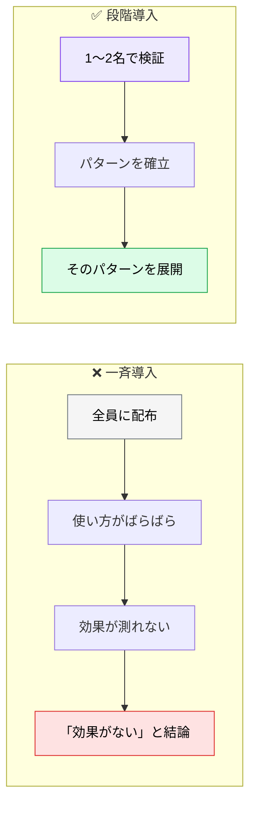

# AI 導入ロードマップ

> **この記事でわかること**：Pilot → Expansion → Rollout の3段階と、各段階で「次に進んでよいか」を判定する指標。

## 結論

導入は3段階に分ける。**段階を飛ばさない。**

| フェーズ | 期間 | 目標 | 活動 |
| --- | --- | --- | --- |
| **Pilot** | 1〜4週 | 効果検証 | **2名**の開発者で非クリティカルな機能に適用（推進役1・懐疑役1） |
| **Expansion** | 5〜12週 | チーム展開 | 全チームで確立されたパターンを適用。機能の50%以上に AI 活用 |
| **Rollout** | 13〜24週 | 組織展開 | 80%以上の採用率。ROI 測定（損益分岐は3〜6ヶ月が目安） |

そして各段階には**判定指標**を置く。

> **「なんとなく良さそう」で次に進まない。** 測っていなければ、次の段階で問題が起きたとき原因が分からない。

## 背景・課題

AI 導入の失敗パターンは決まっている。**全社一斉導入である。**



**Pilot の目的は「効果を出すこと」ではなく「展開できるパターンを見つけること」である。**

## 具体的な方法

### 30 / 60 / 90 日ロードマップ

3段階をさらに日次の実施内容に落とす。

| 期間 | 重点テーマ | 実施内容 | 判定指標 |
| --- | --- | --- | --- |
| **Day 1-30** | 最小導入の定着 | `SPEC.md`、PR レビュー、テスト実行を MUST 化。**並行して AI 利用ポリシーの法務確認を開始**（→ [`../22_security/08_ai-usage-policy.md`](../22_security/08_ai-usage-policy.md)） | 主要 PR の**仕様準拠率** |
| **Day 31-60** | 品質ゲート強化 | CI で静的解析・セキュリティスキャンを標準化 | **Critical/High 脆弱性件数** |
| **Day 61-90** | チーム最適化 | プロンプト資産化、ロール別運用、コスト監視 | **サイクルタイム、LLM コスト/KPI** |

**判定指標の列が要点である。** 期間で区切るのではなく、指標を満たしたら次に進む。

### 各段階のゲート条件

「次に進んでよいか」を明文化する。

| → 次段階 | ゲート条件 |
| --- | --- |
| Pilot → Expansion | ✅ 展開できる手順が文書化されている（`CLAUDE.md` + コマンド）<br/>✅ 「効いた場面」と「効かなかった場面」が言語化できる |
| Expansion → Rollout | ✅ 品質が悪化していない（バグ密度・脆弱性件数）<br/>✅ レビュー体制が形骸化していない |
| Rollout → 定常運用 | ✅ コストが把握できている<br/>✅ 新メンバーがオンボードできる仕組みがある |

**「効かなかった場面」の言語化が最も価値がある。** 全部に効くわけではないと分かっていることが、展開時の期待値管理になる。

### 何から始めるか

Day 1-30 で MUST 化する3つは、**効果が出やすく、失敗しても被害が小さい**順に並んでいる。


**技術的な整備（CLAUDE.md / hooks / MCP）より先に、この3つを回す。** ツールを整えても、使う場面が定まっていなければ効果は出ない。

### Pilot の人選

**誰を選ぶかが成否を分ける。** AI に前向きな人だけで固めると、Expansion で再現しない。

**Pilot は2名。1人を推進役、1人を懐疑役にする。** 両者とも非クリティカルな機能を担当している人から選ぶ。

| 役割 | 選ぶ基準 |
| --- | --- |
| **推進役** | Expansion で伝道役になれる人（手順を人に教えられる） |
| **懐疑役** | 導入に懐疑的な人。**その人が納得した理由が、そのまま展開時の説得材料になる** |

> **懐疑役に難易度の高いタスクを割り当てない。** 「やはりダメだった」という結論を、高い説得力で持ち帰られる。**機械的・影響範囲が小さく・本人が面倒だと思っているタスク**から始める（→ [`03_change-management.md`](03_change-management.md)）。

> **前向きな人だけの Pilot は「できる人ができた」という結果しか出ない。** 展開できるかは分からないままになる（→ [`03_change-management.md`](03_change-management.md)）。

### 効果測定の指標

「速くなった気がする」では説明できない。**測れるものを決めておく。**

そして **導入前のベースラインを必ず取る**。後から「前はどうだったか」は再現できない。導入を決めた時点で取る。

> **どの指標を、どう測るか**（DORA 4指標の使い方、ベースライン取得の具体的な手順）は [`04_quality-metrics.md`](04_quality-metrics.md) に集約している。

### 撤退の判断も決めておく

導入の計画だけでなく、**うまくいかなかったときの縮退**を決めておく。

| 状況 | 対応 |
| --- | --- |
| 品質が悪化している | レビュー体制を戻す。AI の適用範囲を狭める |
| コストが想定を超えた | モデルを下げる、適用範囲を絞る |
| チームが使わない | **なぜ使わないかを聞く**（→ [`03_change-management.md`](03_change-management.md)） |

**「導入したから戻せない」にしない。** 可逆性があることが、現場が試しやすい条件になる。

## 実際のプロンプト例

```text
# 現在地を診断させる
このリポジトリと開発プロセスを確認して、
AI 導入のどの段階にいるか判定して。

判定基準：
- Pilot：1〜2名が試している段階
- Expansion：チーム全体でパターンが共有されている段階
- Rollout：組織的に定着し、指標で管理されている段階

現段階で満たせていないゲート条件を、優先度順に挙げて。
```

```text
# 30日計画を立てさせる
このチーム（[構成を記載]）で AI 駆動開発を始める。
最初の30日の計画を立てて。

条件：
- 対象は1〜2名に絞る
- 非クリティカルな機能から始める
- 30日後に「展開できるか」を判定する指標を含める
- うまくいかなかった場合の撤退条件も含める

週単位で実施内容を示して。
```

## 注意点

> **Pilot の目的は効果を出すことではない。** 「展開できるパターンを見つけること」である。1〜2名で試し、手順を文書化する。

> **導入前のベースラインを必ず取る。** 後から「前はどうだったか」は再現できない（→ [`04_quality-metrics.md`](04_quality-metrics.md)）。

> **段階を飛ばさない。** 全社一斉導入は、効果が測れず「効果がない」という結論になりやすい。

> **撤退・縮退の条件を決めておく。** 可逆性があることが、現場が試しやすい条件になる。

> **損益分岐は3〜6ヶ月が目安である。** 初月で ROI を求めない。学習コストが先に来る。

## 参考リンク

- 次に読む：[`01_shared-resources.md`](01_shared-resources.md) — 共有リソースの設計
- 関連：[`02_team-size-patterns.md`](02_team-size-patterns.md) — 規模別の運用
- 関連：[`04_quality-metrics.md`](04_quality-metrics.md) — 品質メトリクス
