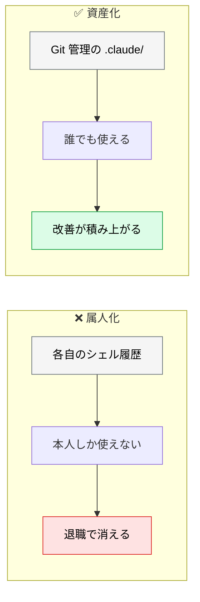
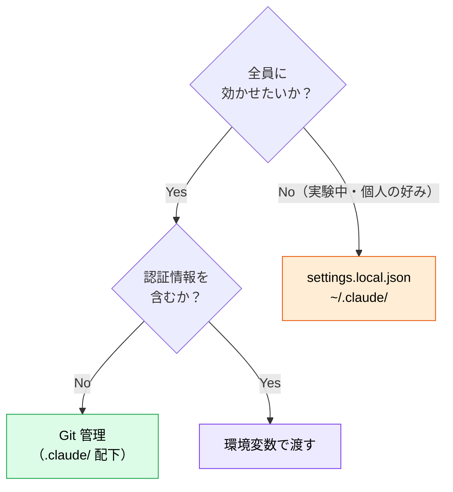

# チームの共有リソース設計

> **この記事でわかること**：チームで共有するものと個人に留めるものの線引き、そして週次で回す運用。

## 結論

共有リソースの設計は1点で決まる。

> **Git 管理下に置くものが「チームの資産」、`.gitignore` に入れるものが「個人設定」。**

そして最も重要なのは、**作って終わりにしない仕組み**である。

> **週次でプロンプトライブラリを共有・更新し、スプリントレビューで `CLAUDE.md` を改善する。**

`CLAUDE.md` は書いた瞬間から陳腐化する。更新のリズムを運用に組み込む。

## 背景・課題

個人が各自で AI を使っていると、次が起きる。

- 同じ規約を全員が個別に説明している
- ベテランは効果的なプロンプトを持っているが共有されていない
- 新メンバーが毎回ゼロから試行錯誤する

**プロンプトと規約は属人化しやすい。** コードなら共有される仕組みがあるのに、これらにはない。



## 具体的な方法

### リポジトリ構成

```text
プロジェクトルート/
├── CLAUDE.md             # プロジェクト憲法（ルート直下・固定）
├── .mcp.json             # MCP サーバー定義
└── .claude/
    ├── settings.json     # Hooks・権限設定
    ├── settings.local.json  # 個人設定（.gitignore）
    ├── commands/         # カスタムスラッシュコマンド
    ├── skills/           # スキル（<name>/SKILL.md 形式）
    ├── agents/           # サブエージェント定義
    └── hooks/            # hooks から呼ぶスクリプト
```

> **⚠️ `CLAUDE.md` は `.claude/` の中ではなく、プロジェクトルート直下に置く。** ここを間違えると「`CLAUDE.md` を書いたのにルールが守られない」という、最も切り分けが難しい不具合になる。配置の詳細は [`../01_claude-code/09_directory-structure.md`](../01_claude-code/09_directory-structure.md) を参照する。

| Git 管理する | しない |
| --- | --- |
| `CLAUDE.md` | `settings.local.json` |
| `settings.json`（hooks・権限） | 個人の実験的な設定 |
| `commands/` `skills/` `agents/` | 認証情報を含むもの |

> **⚠️ `.claude/` の共有は任意コード実行の受け入れである。** `settings.json` の hooks は、そのブランチを checkout した**全員のマシンで実行される**。CODEOWNERS でレビュー必須にする（→ [`../01_claude-code/09_directory-structure.md`](../01_claude-code/09_directory-structure.md)）。

### 週次ルーティン

**作って終わりにしない**ための運用である。

| タイミング | アクション |
| --- | --- |
| **スプリント計画** | スペック作成セッション（AI インタビューで仕様を詰める） |
| **実装中** | Claude Code / Cursor でタスク実行、日次で `CLAUDE.md` をレビュー |
| **PR 作成時** | Copilot 自動レビュー + Claude による仕様整合性チェック |
| **スプリントレビュー** | AI 生成コードの品質メトリクスを振り返り、`CLAUDE.md` を改善 |
| **週1回** | チームでプロンプトライブラリを共有・更新 |

**スプリントレビューで `CLAUDE.md` を改善する**のが要点である。振り返りの議題に入れないと、誰も更新しない。

### 何を共有し、何を個人に留めるか



**実験中のものは個人に留める。** 定着してから共有に移す。逆をやると、使われない設定がチームに残り続ける。

### プロンプトの格上げ基準

**「3回使ったら」を目安にコマンド化する。** 1〜2回では汎用化すべき部分が見えない。個人用（`~/.claude/commands/`）とチーム共有（`.claude/commands/`）の使い分けを含む詳細は [`../05_prompt-engineering/02_versioning.md`](../05_prompt-engineering/02_versioning.md) を参照する。

### エンジニア以外も参加させる

プロンプトライブラリの改善に、**プロダクトマネージャー・ドメインエキスパートも参加させる**。

| 役割 | 貢献できること |
| --- | --- |
| **PM** | 仕様作成プロンプトの観点、受け入れ基準の書き方 |
| **ドメインエキスパート** | 業務ルールの正確な表現、専門用語の定義 |
| **デザイナー** | デザインレビューの観点、ペルソナ定義 |

**エンジニアだけで作ると、エンジニアの盲点がそのまま残る。**

### 変更は PR を通す

`CLAUDE.md` やコマンドの変更は**チーム全員の出力に影響する**。コードと同じ扱いにする。

> **ただしプロンプトにはテストがない。** コードなら CI が守るが、コマンドの変更は誰も検証しない。**代表タスク5件を新旧で流して出力を目視比較する**程度の軽量な回帰セットを用意する。

## 実際のプロンプト例

```text
# 共有すべきものの棚卸し
私の ~/.claude/commands/ と .claude/commands/ を比較して、
個人用に置いているが実はチームで共有すべきコマンドがないか診断して。

判定基準：
- このプロジェクト固有の内容か（汎用なら個人用でよい）
- 他のメンバーも同じ作業をするか
- 出力の一貫性が重要か

共有に移すべきものを挙げて、移動後の description 案も示して。
```

```text
# CLAUDE.md の棚卸し（スプリントレビュー用）
@CLAUDE.md を読んで、直近のスプリントで実際に効いたルールと
効いていないルールを推測して。

判定材料として、直近のコミット履歴とレビューコメントも見て。

「削除候補」「追記すべき内容」を提案して。
削除候補には、なぜ効いていないと判断したかの根拠を添えて。
```

```text
# .claude/ の安全性監査
.claude/ 配下と .gitignore を読んで、次を確認して。

1. 認証情報が含まれるファイルが Git 管理下にないか
2. 個人設定（settings.local.json）が ignore されているか
3. hooks で実行されるスクリプトの内容が妥当か
4. CODEOWNERS で .claude/ が保護されているか

問題があれば、危険度の高い順に修正案を示して。
```

## 注意点

> **`.claude/` の共有は任意コード実行の受け入れである。** hooks は checkout した全員のマシンで実行される。CODEOWNERS でレビュー必須にする。

> **スプリントレビューの議題に `CLAUDE.md` を入れる。** 更新のリズムを運用に組み込まないと、誰も直さない。

> **実験中のものは共有しない。** 定着してから移す。逆をやると、使われない設定が残り続ける。

> **エンジニア以外も参加させる。** エンジニアだけで作ると盲点がそのまま残る。

> **プロンプトの変更にはテストがない。** 軽量な回帰セット（代表タスク5件の目視比較）を用意する。

> **認証情報は環境変数で渡す。** `.mcp.json` や `settings.json` に直書きしない。

## 参考リンク

- 関連：[`../01_claude-code/09_directory-structure.md`](../01_claude-code/09_directory-structure.md) — 配置とスコープ
- 関連：[`../05_prompt-engineering/02_versioning.md`](../05_prompt-engineering/02_versioning.md) — プロンプトの資産化
- 関連：[`02_team-size-patterns.md`](02_team-size-patterns.md) — 規模による違い
