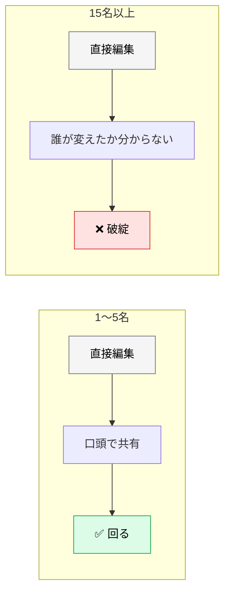
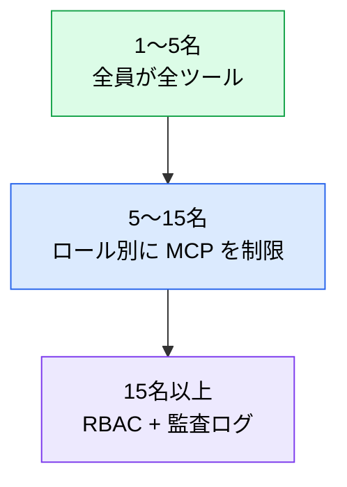

# チーム規模別の運用パターン

> **この記事でわかること**：小規模で回る暗黙知の運用が、どの規模で破綻するか。

## 結論

規模によって運用は大きく変わる。境目は明確である。

> **小規模チームでは暗黙知で回せる仕組みも、20名を超えると明示的なガバナンスが必要になる。**

破綻するのは「人が増えたから」ではない。**同期の手段が口頭からドキュメントに変わるから**である。

## 背景・課題

5名なら「これ変えたよ」と言えば伝わる。50名では伝わらない。



**規模に合わない運用を入れると別の問題が起きる。** 3名のチームに RBAC と監査ログを課すと、手続きが開発速度を殺す。

## 具体的な方法

### 規模別の比較

| 観点 | **1〜5名**（スタートアップ） | **5〜15名**（プロダクトチーム） | **15名以上**（組織横断） |
| --- | --- | --- | --- |
| **CLAUDE.md 管理** | 1ファイルを全員で直接編集 | チームリードが管理、**PR 経由**で変更 | モノレポ：共通ベース + チーム別オーバーライド。変更は専用レビュアーが承認 |
| **プロンプトライブラリ** | 各自が `commands/` に自由追加 | **チーム標準を定義**、個人拡張は `~/.claude/commands/` `~/.claude/skills/` | 中央リポジトリで標準を管理。チーム別カスタマイズは継承で実現 |
| **コスト管理** | 個人の利用量を月次確認 | チーム予算を設定、**週次でダッシュボード確認** | AI ゲートウェイで**チーム別クォータ**。月次で ROI レポート |
| **権限・ガバナンス** | 全員が全ツールにアクセス可 | **ロール別に MCP 接続先を制限** | **RBAC** で MCP・エージェント権限を管理。**監査ログ必須** |
| **オンボーディング** | ペアプロで口頭伝達 | チェックリスト + 初週ペアプロ | 研修プログラム（座学1日 + OJT 1週間）+ メンター制度 |

### 段階が変わる合図

規模の数字より、**症状で判断する**ほうが実務的である。

| 症状 | 次の段階へ |
| --- | --- |
| 「誰が `CLAUDE.md` を変えたか分からない」 | → **PR 経由**に切り替える |
| 「同じプロンプトを各自が別々に持っている」 | → **チーム標準**を定義する |
| 「先月いくら使ったか誰も知らない」 | → **予算とダッシュボード**を設定する |
| 「新メンバーが1週間で立ち上がらない」 | → **オンボーディング手順**を文書化する |
| 「誰がどの MCP に繋いでいるか把握できない」 | → **ロール別の制限**を導入する |

**症状が出てから対処する。** 先回りしてガバナンスを入れると、必要のない手続きが定着する。

> **個人拡張はユーザースコープ（`~/.claude/`）に置く。** `settings.local.json` は**権限と hooks の設定ファイル**であり、コマンドやスキルは書けない。

### 過剰なガバナンスを避ける

| 規模 | やらなくてよいこと |
| --- | --- |
| 1〜5名 | RBAC、監査ログ、研修プログラム、ROI レポート |
| 5〜15名 | チーム別クォータ、専用レビュアー制度 |

**「将来必要になるから今から」をやらない。** 3名のチームに監査ログを課しても、誰も見ない。

### 15名を超えたときの設計

モノレポでは**共通ベース + チーム別オーバーライド**の構造にする。

```text
CLAUDE.md                      # 全社共通の規約
packages/
  api/
    CLAUDE.md                  # API チーム固有の規約
  web/
    CLAUDE.md                  # フロントエンドチーム固有の規約
```

| 階層 | 書くこと |
| --- | --- |
| **ルート** | セキュリティ・コミット規約・全社共通の禁止事項 |
| **チーム別** | 技術スタック固有の規約、そのチームの慣習 |

> **サブディレクトリの `CLAUDE.md` は使いすぎない。** 階層が増えるほど「どのルールが効いているか」が把握しにくくなる。**パッケージ間で技術スタックが本当に違う場合に限る。**

### 権限設計

規模が大きくなるほど、**全員が全ツールにアクセスできる状態が危険**になる。



エンタープライズ設定（管理者が配布する `managed-settings.json`）は、**ユーザーやプロジェクト側から上書きできない**。組織として強制したい項目はここで固定する（→ [`../22_security/07_claude-code-hardening.md`](../22_security/07_claude-code-hardening.md)）。

### オンボーディングの中身

規模に関わらず、新メンバーが最初に知るべきことは同じである。

| 項目 | 内容 |
| --- | --- |
| **何が Git 管理されているか** | `.claude/` の何を触ってよいか |
| **変更の手順** | 直接編集か PR か |
| **禁止事項** | `permissions.deny` に何が入っているか、なぜか |
| **よく使うコマンド** | `/review` などチーム標準のコマンド |
| **コストの目安** | 1タスクあたりどれくらい使うか |

**最後の項目が抜けやすい。** 目安を知らないと、無自覚に高コストな使い方をする。

## 実際のプロンプト例

```text
# 現在の規模に合った運用か診断
このチーム（[人数と構成]）の AI 運用が、規模に対して
過剰でないか / 不足していないか診断して。

観点：
- CLAUDE.md の管理方法（直接編集 / PR / 承認制）
- プロンプトの共有方法
- コスト管理
- 権限・ガバナンス
- オンボーディング

「今やるべきこと」と「まだ不要なこと」に分けて提案して。
```

```text
# 症状から次の段階を判定
最近チームで次の問題が起きている。

[症状を記載]

これがどの運用課題に対応するか判定して、
次に導入すべき仕組みを1つだけ提案して。
一度に複数導入する提案はしないで。
```

```text
# オンボーディング資料の作成
新メンバー向けに、このリポジトリの AI 開発環境の
オンボーディング資料を作って。

含めるもの：
- .claude/ の何が Git 管理されているか
- 変更したいときの手順
- permissions.deny に入っている禁止事項とその理由
- チーム標準のコマンド一覧
- 1タスクあたりのコスト目安

初日に読んで30分で理解できる分量にして。
```

## 注意点

> **規模に合わない運用を入れない。** 3名のチームに RBAC と監査ログを課すと、手続きが開発速度を殺す。

> **症状が出てから対処する。** 「将来必要になるから今から」は、使われない手続きを定着させる。

> **サブディレクトリの `CLAUDE.md` を増やしすぎない。** どのルールが効いているか把握できなくなる。

> **オンボーディングにコストの目安を含める。** 知らないと無自覚に高コストな使い方をする。

> **エンタープライズ設定は上書きできない。** 組織として強制したい項目はここで固定する。個人の裁量に任せない。

## 参考リンク

- 関連：[`01_shared-resources.md`](01_shared-resources.md) — 共有リソースの設計
- 関連：[`00_adoption-roadmap.md`](00_adoption-roadmap.md) — 導入の段階
- 関連：[`../22_security/07_claude-code-hardening.md`](../22_security/07_claude-code-hardening.md) — 権限設定
