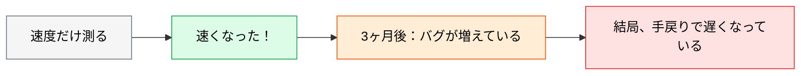
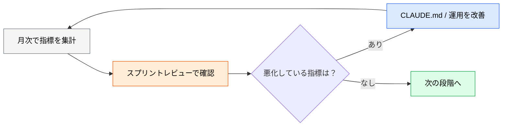

# AI 生成コードの品質メトリクス

> **この記事でわかること**：追跡すべき KPI と、AI 専用の指標を作らないほうがよい理由。

## 結論

測る対象は**速度だけではない**。速度と品質を同時に見る。

| メトリクス | 測定方法 | 目標 |
| --- | --- | --- |
| 生産性向上 | サイクルタイム | ベースライン比で改善（+30〜50% は一般に報告される水準の**目安**。自チームのベースラインで再定義する） |
| **バグ密度** | バグ件数 / KLOC | **導入前と同水準以下** |
| **セキュリティ脆弱性** | SAST の**トリアージ後**の未対応件数 | **Critical/High がゼロ**（例外は期限と承認者を記録） |
| 変更失敗率 | revert / hotfix の割合 | 導入前と同水準以下 |
| 仕様逸脱 | レビューで検出された仕様逸脱件数 / マージ PR 数 | 導入前と同水準以下 |

> **テストカバレッジを目標値にしない。** AI はカバレッジ目標を渡すと、それを満たすためだけの薄いテストを書く。**「生成行数」と同じ Goodhart 問題**である（→ [`../15_test/00_test-strategy.md`](../15_test/00_test-strategy.md)）。目標にするなら **変更行カバレッジ（diff coverage）** や **ミューテーションスコア**のように誤魔化しにくい指標を選ぶ。

> **SAST の生の検出件数をゼロにしない。** false positive を含むため実運用でゼロにはならず、数字を作るために抑制ルール（`# nosec` 等）が乱発され、**本物の脆弱性まで隠れる**。トリアージ後の未対応件数で見る。

そして測り方の原則がある。

> **AI 専用の指標を作らない。** DORA など既存の指標を使えば、他の改善施策と横並びで評価できる。

## 背景・課題

「AI で速くなった」だけを測ると、**品質の劣化を見逃す**。



**速度と品質はセットで見る。** どちらか一方では、導入の是非を判断できない。

## 具体的な方法

### DORA 指標を軸にする

AI 専用の指標を作るより、**既存の DORA 4指標**に AI 導入の影響を見るほうが実務的である。

| DORA 指標 | AI 導入で見たいこと |
| --- | --- |
| **デプロイ頻度** | 実装が速くなればリリースも増えるはず |
| **変更のリードタイム** | コミットから本番までの時間 |
| **変更失敗率** | **品質が落ちていないか（最重要）** |
| **MTTR** | 障害対応が速くなったか |

**変更失敗率が最も重要である。** 速度が上がっても失敗率が上がれば、正味では改善していない。

> 他の改善施策（CI の高速化、テスト整備）と**同じ物差しで比較できる**のが利点である。「AI の効果」だけを切り出そうとすると、かえって評価が難しくなる。

### ベースラインを取る

**導入前の数値がなければ、比較のしようがない。**

| 取るタイミング | 内容 |
| --- | --- |
| **導入前** | 過去3ヶ月の実績を集計 |
| 導入後 | 同じ集計を月次で継続 |

```text
gh で過去3ヶ月の PR を取得して、次を集計して。

- PR の作成からマージまでの中央値
- 1 PR あたりの変更行数の中央値
- レビューコメント数の中央値
- マージ後1週間以内に同じファイルが修正された割合（手戻り率）

CSV 形式で出力して。後で比較できる形にして。
```

**後から「前はどうだったか」は再現できない。** 導入を決めた時点で取る。

### AI 生成コードを識別する

「AI 生成コードのバグ密度」を測るには、**どれが AI 生成かを識別できる必要がある**。

| 手段 | 内容 |
| --- | --- |
| **コミットメッセージ** | AI が関与した変更に印を付ける |
| **PR ラベル** | `ai-assisted` などのラベル運用 |
| **ツール側の計測** | SonarQube の「AI Code Assurance」等 |

**厳密に分けようとしない。** 実務では「AI を使い始めた前後」で比較するほうが現実的である。

### 測るのをやめるべき指標

| ❌ 測らない | 理由 |
| --- | --- |
| **生成行数** | 多いほど良いわけではない。むしろ逆 |
| **テストカバレッジ（目標値として）** | AI なら薄いテストで一晩で到達できる |
| コード補完の受諾率 | 品質と相関しない |
| AI への質問回数 | 多い＝活用している、とは限らない |

**「生成行数」を KPI にすると、冗長なコードが増える。** 測る対象を間違えると、行動が歪む。

### 役割の変化を指標にする

**時間配分の変化が指標になる。** 「実装に使う時間が減り、レビューと設計に使う時間が増えた」なら、移行は進んでいる。

役割がどう変わるかの整理は [`03_change-management.md`](03_change-management.md) にある。

### 振り返りの場に載せる

測っても見なければ意味がない。**スプリントレビューの議題にする。**



**悪化している指標があれば、そこが改善対象になる。** 全部が良くなることは稀である。

### コストも指標に入れる

品質と速度だけでなく、**コスト効率**も見る。

| 指標 | 意味 |
| --- | --- |
| **LLM コスト / 完了タスク数** | 1タスクあたりのコスト |
| LLM コスト / 開発者 | 月次の1人あたり |
| **レート上限への到達回数** | チーム開発が止まった回数 |

**最後の指標が実務では効く。** 金額より「止まったかどうか」のほうが影響が大きい（→ [`../21_cicd-ops/06_finops.md`](../21_cicd-ops/06_finops.md)）。

## 実際のプロンプト例

```text
# ベースラインの取得
gh で過去3ヶ月の PR を取得して、次を集計して CSV で出力して。

- PR の作成からマージまでの時間（中央値・p90）
- 1 PR あたりの変更行数（中央値）
- レビューコメント数（中央値）
- マージ後1週間以内に同じファイルが修正された割合

月別に分けて、後で比較できる形にして。
```

```text
# 品質の変化を検証
AI 導入前後（[時期を記載]）で、次の指標がどう変化したか比較して。

- 変更失敗率（revert / hotfix の割合）
- バグ Issue の起票数
- Critical/High の脆弱性検出数

速度だけでなく品質が維持されているか判定して。
悪化している指標があれば、原因の仮説を複数挙げて。
```

```text
# 時間配分の変化を推測
過去3ヶ月のコミット履歴とレビューコメントから、
チームの作業内容の傾向変化を分析して。

- 実装コミットの割合
- レビューコメントの量と質（指摘の種類）
- 設計文書（docs/）の更新頻度

「コードを書く」から「レビューと設計」への移行が
進んでいるか判定して。
```

## 注意点

> **速度だけを測らない。** 品質が落ちれば、手戻りで正味では遅くなる。変更失敗率を必ず見る。

> **AI 専用の指標を作らない。** DORA など既存の指標を使えば、他の改善施策と横並びで評価できる。

> **導入前のベースラインを取る。** 後から再現できない。導入を決めた時点で取る。

> **「生成行数」を KPI にしない。** 測る対象を間違えると、冗長なコードが増える方向に行動が歪む。

> **AI 生成コードの厳密な識別にこだわらない。** 「導入前後の比較」で十分実用的である。

> **測っても見なければ意味がない。** スプリントレビューの議題に載せる。

> **レート上限への到達回数を見る。** 金額より「チームが止まったか」のほうが影響が大きい。

## 参考リンク

- 関連：[`00_adoption-roadmap.md`](00_adoption-roadmap.md) — 段階のゲート条件
- 関連：[`03_change-management.md`](03_change-management.md) — 「速くなった実感がない」への答え
- 関連：[`../21_cicd-ops/06_finops.md`](../21_cicd-ops/06_finops.md) — コストの測り方
