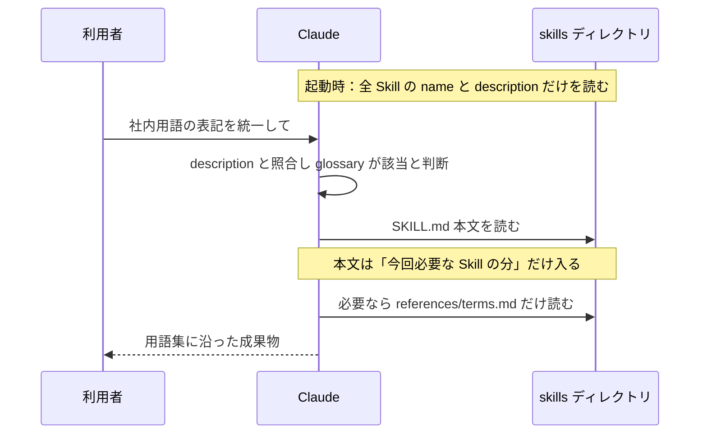
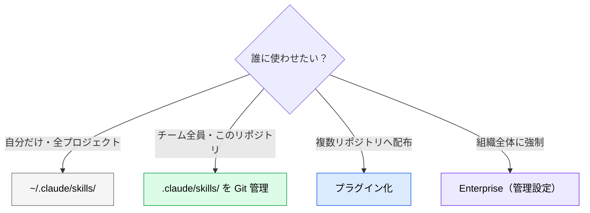

# Skills の仕組み：Progressive Disclosure と置き場所

> **この記事でわかること**：Skills が「大量に入れてもコンテキストを圧迫しない」理由（3層ロード）と、どこに置けば誰が使えるか。シリーズ全体の前提になる。

## 結論

Skills は **「専門知識と手順を、必要になった瞬間にだけ読み込ませる仕組み」** である。

- 常時読まれるのは各 Skill の `name` と `description` だけ（1件あたり約100トークン）
- 本文は **Claude が「今これが要る」と判断したときだけ** 読まれる
- 詳細資料・スクリプトは **本文から参照されたときだけ** 読まれる／実行される

この段階的な開示（Progressive Disclosure）により、**知識の量とコンテキスト消費が切り離される**。

> 入口編（形式・基本形）は [`../01_claude-code/04_skills.md`](../01_claude-code/04_skills.md)。本シリーズはその先、**作る・書く・試す・配る**を扱う。

## 背景・課題

AI に自社ルールを守らせようとすると、たいてい次のどちらかに行き着く。

| やり方 | 起きる問題 |
| --- | --- |
| 毎回プロンプトに貼る | 手間がかかり、貼り忘れで品質がぶれる |
| CLAUDE.md に全部書く | 常時ロードされ続け、肥大化して指示が埋もれる |

Skills はこの中間を埋める。**「毎回は要らないが、要るときは確実に要る知識」** の置き場所である。

### Skills が効く3つの場面

| 場面 | 例 |
| --- | --- |
| **ドキュメント・成果物の作成** | 社内用語集に沿った文書、デザインガイドライン準拠の UI、報告書テンプレート |
| **ワークフローの自動化** | 定型のレビュー手順、Issue 修正フロー、リリース作業 |
| **MCP の強化** | 「どの MCP をいつ呼ぶか」の規約を持たせ、ツール選択の迷いを減らす（→ [`../05_prompt-engineering/03_skills-integration.md`](../05_prompt-engineering/03_skills-integration.md)） |

> 「すべての仕事は Skills 化の候補になる」という見方が実践の出発点になる。**同じ説明を3回したら Skill にする**くらいの感覚でよい。

## 具体的な方法

### 3層ロードの仕組み



| 層 | いつ読まれるか | 目安 | 中身 |
| --- | --- | --- | --- |
| **Level 1：メタデータ** | 常時（起動時） | 約100トークン / 件 | frontmatter の `name` と `description` |
| **Level 2：本文** | Skill が発動したとき | 上限：5,000トークン未満・500行以内（公式推奨） | SKILL.md の手順・規約 |
| **Level 3：付属リソース** | 本文が参照したとき | 読むまでゼロ | `references/` の資料、`scripts/` の実行結果、`assets/` のテンプレート |

ポイントは Level 3 である。**スクリプトは「実行」されるだけで、コード自体はコンテキストに入らない**。出力だけがトークンを消費する。同じ処理を Claude に毎回書かせるより、確実で安い。そのぶん、**人がコードを読んでレビューする責任**が生じる（→ [`08_security-governance.md`](08_security-governance.md)）。

### 置き場所と共有範囲（Claude Code）

| 場所 | パス | 使える人 |
| --- | --- | --- |
| **Enterprise** | 管理設定のディレクトリ | 組織の全ユーザー |
| **Personal** | `~/.claude/skills/<name>/SKILL.md` | 自分の全プロジェクト |
| **Project** | `.claude/skills/<name>/SKILL.md` | そのリポジトリで作業する全員（Git で共有） |
| **Nested** | `<サブディレクトリ>/.claude/skills/<name>/SKILL.md` | 該当ディレクトリ配下で作業するとき（モノレポ向け） |
| **Plugin** | `<plugin>/skills/<name>/SKILL.md` | プラグイン有効時（`/plugin-name:skill-name` で呼ぶ） |

同名の Skill が複数あるときは **Enterprise > Personal > Project** の順で優先される（2026年9月時点の公式ドキュメント）。

> 設定ファイル一般の「狭いスコープが優先」（→ [`../01_claude-code/09_directory-structure.md`](../01_claude-code/09_directory-structure.md)）とは**向きが逆**である。これは **Skill 名の衝突解決だけ**の規則で、個人側に同名があると、チームの Skill が気づかないまま上書きされる。Project の Skill 名は個人側で使わず、`/skills` で上書きされていないか確認する。



> 迷ったら **Project（`.claude/skills/`）から始める**。Git に載るのでレビューでき、チームで同じ Skill を共有できる。個人の好みだけ Personal に置く。

### 他の部品との使い分け

| 部品 | 読まれるタイミング | 向いているもの |
| --- | --- | --- |
| CLAUDE.md | **常時** | 全タスクに効く原則・禁止事項 |
| **Skills** | **必要なときだけ** | 特定作業の手順・規約・テンプレート |
| sub-agent | 委譲されたとき | 独立コンテキストでの調査・レビュー |
| hooks | イベント発生時（**強制**） | 破られたら困るルール |

判断は1つ。**「全タスクで要るか？」→ No なら Skills**。詳細は [`../01_claude-code/03_claude-md.md`](../01_claude-code/03_claude-md.md) と [`../01_claude-code/06_hooks.md`](../01_claude-code/06_hooks.md) を参照。

### sub-agent に Skill を渡す

sub-agent の frontmatter に `skills:` を書くと、**起動時に Skill の全文が sub-agent のコンテキストへ注入**される。発見・読み込みの手間なく、最初から規約を持たせられる。

```yaml
---
name: api-developer
description: チームの規約に沿って API エンドポイントを実装する
skills:
  - api-conventions
  - error-handling-patterns
---
```

| 方向 | 書く場所 | 主導するのは |
| --- | --- | --- |
| **sub-agent に Skill を渡す** | sub-agent 側の `skills:` | sub-agent |
| **Skill を sub-agent で動かす** | Skill 側の `context: fork` + `agent`（→ [`06_invocation-control.md`](06_invocation-control.md)） | Skill |

> `disable-model-invocation: true` の Skill は、`skills:` では渡せない。

### コンテキストの消費を確かめる

「description は常時載る」には例外がある。**`disable-model-invocation: true` の Skill は description も載らない**（人が呼んだときだけ全文が入る）。実際の消費は `/context` などで内訳を確認する（表示項目は版により異なる）。

## 実際のプロンプト例

```text
# 今ある Skills の棚卸し
このリポジトリの .claude/skills/ と ~/.claude/skills/ を一覧して、
name / description / SKILL.md の行数を表にして。
description だけでは「いつ使うか」が分からないものに印を付けて。

# 「Skill にすべきもの」の発見
最近のコードレビューコメントと、CLAUDE.md に追記してきた内容を読んで、
繰り返し指摘・説明している事柄を洗い出して。
3回以上出てきたものを Skill 化の候補として、
「候補名 / 何を書くか / 常時要るか（CLAUDE.md向き）か否か（Skill向き）」で表にして。
```

## 注意点

> **Skills は全サーフェスで同期されない。** Claude Code のファイル、claude.ai へアップロードした Skill、API へアップロードした Skill は互いに別物である。配布の詳細は [`07_distribution.md`](07_distribution.md)。

> **「入れるほど重くなる」わけではないが、ゼロコストでもない。** description は常時載る。似た Skill を大量に並べると、Claude が選び間違える。**1 Skill = 1 関心事**を守る。

> **Skills は「お願い」であり強制ではない。** 必ず守らせたい制約は hooks で担保する。他人の Skill を入れるときの安全面は [`08_security-governance.md`](08_security-governance.md)。

## 参考リンク

- [Agent Skills 概要（Claude Platform Docs）](https://platform.claude.com/docs/en/agents-and-tools/agent-skills/overview)
- [Use Skills in Claude Code（公式）](https://code.claude.com/docs/en/skills)
- [Claude Code Skillsに入門しよう！（Zenn）](https://zenn.dev/jackpotjack/articles/30de567059dd19) — 本シリーズの構成の参考
- 次：[`01_skill-anatomy.md`](01_skill-anatomy.md) — SKILL.md の中身
