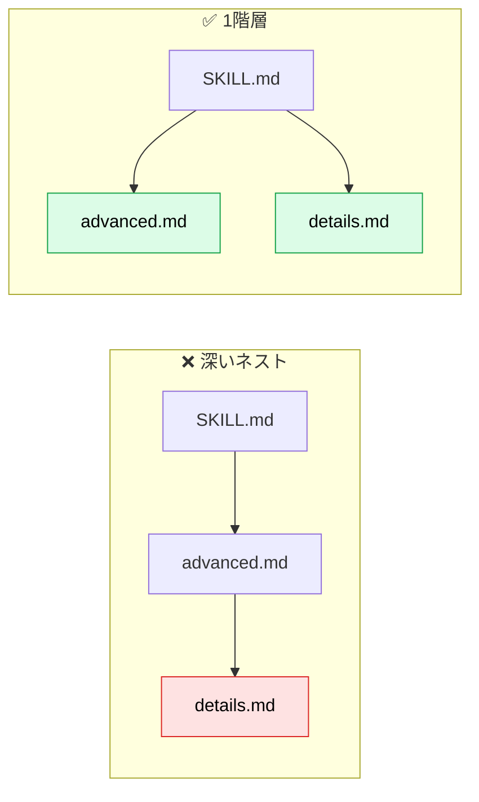

# SKILL.md の構造：ディレクトリと frontmatter

> **この記事でわかること**：Skill フォルダに何を置くか、frontmatter の各フィールドの意味と制約、命名の作法。読み終えれば、壊れない SKILL.md の骨格を書ける。

## 結論

Skill は **「`SKILL.md` を1つ含むフォルダ」** である。必須なのはそれだけ。

- frontmatter で必須なのは `name` と `description`（Claude Code では `name` 省略可・フォルダ名が既定）
- 本文は **500行以内**。超えたら `references/` に移す
- 繰り返し使う処理は **`scripts/` に実行可能なコードとして置く**
- 参照は **SKILL.md から1階層まで**

## 背景・課題

「とりあえず SKILL.md に全部書く」と、次の失敗が起きる。

| 失敗 | 原因 |
| --- | --- |
| 呼び出された瞬間にコンテキストが埋まる | 本文が肥大化している |
| 資料の一部しか読み込まれない | 参照が深くネストし、部分読みされた |
| 実行のたびに結果がばらつく | 決まった処理を文章で指示している |
| 別環境で動かない | `name` の規則違反、パス区切りの誤り |

## 具体的な方法

### ディレクトリ構成

```text
# 拡張後の構成例（03 で最初に作るのは SKILL.md と references/ のみ）
company-glossary/
├── SKILL.md              # 必須：メタデータ + 手順（Level 1・2）
├── references/           # 任意：必要なときだけ読む資料（Level 3）
│   ├── terms.md
│   └── forbidden.md
├── scripts/              # 任意：実行されるコード（中身はコンテキストに入らない）
│   └── check_terms.py
└── assets/               # 任意：テンプレート・画像・データ
    └── report-template.md
```

| フォルダ | 置くもの | 使い方 |
| --- | --- | --- |
| `references/` | 詳細仕様、用語表、ドメイン別ガイド | SKILL.md から「〜は `references/x.md` を読む」と誘導する |
| `scripts/` | 検証・変換・集計など**決まった処理** | 「`scripts/x.py` を**実行**する」と明記する |
| `assets/` | テンプレート、スキーマ、画像 | 成果物の雛形として使う |

> `scripts/` は「**読む**のか **実行する**のか」を SKILL.md に必ず書き分ける。曖昧だとコードを読み込んで消費するだけになる。

### frontmatter のフィールド

#### 共通仕様（Agent Skills オープン標準）

| フィールド | 必須 | 制約 |
| --- | --- | --- |
| `name` | ○ | 64文字以内。小文字・数字・ハイフンのみ。ハイフンで始まらない・終わらない・連続しない。**ディレクトリ名と一致**させる。`claude` / `anthropic` は予約語 |
| `description` | ○ | 1,024文字以内。空不可。**何をするか + いつ使うか**（→ [`02_writing-description.md`](02_writing-description.md)） |
| `license` | — | ライセンス名、または同梱ファイル名 |
| `compatibility` | — | 500文字以内。必要な環境（例：git・docker が要る）。**大半の Skill は不要** |
| `metadata` | — | 任意の文字列キーと値。独自管理用（version・author など） |
| `allowed-tools` | — | 事前許可するツール（実験的。実装によって挙動が異なる） |

`name` と `description` に **XML タグは使えない**。

#### Claude Code 独自の拡張

| フィールド | 効果 | 詳細 |
| --- | --- | --- |
| `disable-model-invocation` | `true` で Claude の自動呼び出しを止め、人間の `/name` 呼び出し専用にする | [`06_invocation-control.md`](06_invocation-control.md) |
| `user-invocable` | `false` で `/` メニューから隠し、Claude だけが使う背景知識にする | 同上 |
| `context` / `agent` | `context: fork` で独立した sub-agent として実行する | 同上 |
| `paths` | 該当パスのファイルを扱うときだけ読み込む（glob 指定） | 同上 |
| `argument-hint` / `arguments` | 引数の補完表示・名前付き引数 | 同上 |
| `when_to_use` | `description` に追記される呼び出し条件。両者の合計に上限がある（1,536文字 / 2026年9月時点） | [`02_writing-description.md`](02_writing-description.md) |

> 独自拡張を使った Skill は **Claude Code 専用**になる。claude.ai や API でも使う予定があるなら、共通仕様の範囲で書く。

### 命名の作法

| 良い | 避ける |
| --- | --- |
| `writing-documentation`（動名詞形） | `helper` / `utils` / `tools`（曖昧） |
| `pdf-processing`（名詞句） | `documents` / `data`（汎用的すぎる） |
| `code-review`（動作形） | `claude-tools`（予約語を含む） |

**コレクション内で命名パターンを揃える**と、一覧したときに役割が読み取れる。`name` に日本語は使えないため、日本語の説明は `description` に書く。

### 本文の書き方

```markdown
---
name: api-conventions
description: プロジェクトの REST API 設計規約。API のエンドポイントを追加・変更するときに使う
---

# API 設計規約

## 手順

1. 既存エンドポイントの命名を確認する
2. 下の規約に沿って設計する
3. `scripts/lint_openapi.py` を**実行**して違反がないか確認する

## 規約（要点）

- URL はケバブケース、JSON プロパティはキャメルケース
- 一覧系は必ずページネーションを付ける

## 詳細

- エラーレスポンスの形式 → `references/errors.md`
- バージョニング方針 → `references/versioning.md`
```

| 原則 | 理由 |
| --- | --- |
| **Claude が既に知っていることは書かない** | 一般知識の説明はトークンの浪費。**自社固有の情報だけ**書く |
| **手順は番号付き、判断は条件分岐で** | 順序どおりに実行されやすい |
| **用語を統一する** | 「エンドポイント / URL / パス」を混ぜると解釈がばらつく |
| **時期依存の記述を避ける** | 「2026年3月までは旧 API」は陳腐化する。「現行」と「旧方式（非推奨）」に分ける |
| **選択肢を並べすぎない** | 既定を1つ決め、例外だけ書く |

### 参照を1階層に保つ



参照の先からさらに参照されたファイルは、Claude が先頭だけ部分的に読むことがある。**すべての資料を SKILL.md から直接リンクする**。100行を超える資料には先頭に目次を置く。

## 実際のプロンプト例

```text
# 骨格を作らせる
.claude/skills/api-conventions/ を作って。
- SKILL.md：frontmatter + 手順 + 規約の要点（100行以内）
- references/errors.md：エラーレスポンス設計
- scripts/lint_openapi.py：OpenAPI の命名規約を検証（違反があれば非ゼロで終了）
description には「何をするか」と「いつ使うか」を必ず入れて。
name はディレクトリ名と一致させて。

# 既存 Skill の構造チェック
.claude/skills/ 配下の全 Skill を確認して、次の違反を一覧にして。
- name がディレクトリ名と不一致
- SKILL.md が500行超
- references から更に別ファイルへ参照している（2階層以上）
- scripts を「読む」のか「実行する」のか不明
```

## 注意点

> **`name` とディレクトリ名は揃える。** ずれると、他のエージェントで使ったときに読み込まれない原因になる。

> **YAML の書式ミスは、エラーにならないことがある。** `description` にコロン（`:`）や先頭の記号を含める場合は引用符で囲む。壊れていても Skill 自体は読み込まれ、フィールドだけが空になることがある。

> **パスは常にスラッシュ（`/`）で書く。** `scripts\helper.py` のような Windows 形式は、他 OS で失敗する。

> **本文の行数は上限として扱う（公式推奨は500行以内）。** 超えたら、迷わず `references/` へ分割する。

## 参考リンク

- [Agent Skills 仕様](https://agentskills.io/specification)
- [Skill authoring best practices（公式）](https://platform.claude.com/docs/en/agents-and-tools/agent-skills/best-practices)
- 前：[`00_how-skills-work.md`](00_how-skills-work.md) / 次：[`02_writing-description.md`](02_writing-description.md)
