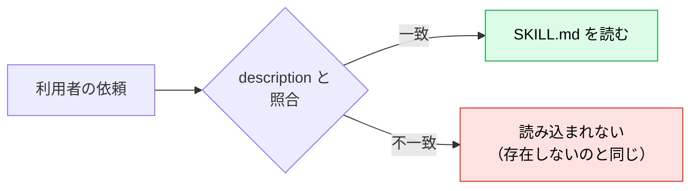
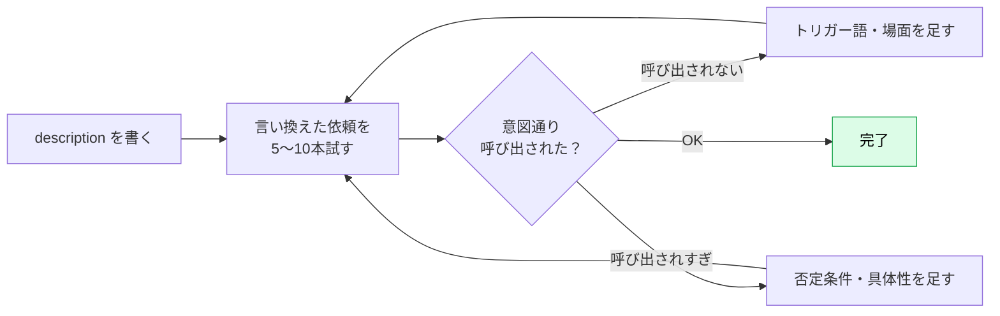

# description の書き方：Skill が呼び出されるかは1文で決まる

> **この記事でわかること**：Claude が Skill を「使う／使わない」と判断する唯一の手がかり、`description` の書き方。呼び出されない・呼び出されすぎるときの直し方までを扱う。

## 結論

`description` は **Skill の説明文であり、呼び出し条件そのもの** である。Claude は起動時に全 Skill の description を読み、依頼と照合して「どれを使うか」を決める。**本文がどれだけ優れていても、description が弱ければ一度も読み込まれない。**

型は次の3点セット。

```text
何をするか（機能） + いつ使うか（場面） + トリガーとなる言葉（キーワード）
```

## 背景・課題

description は Skill 全体で最も短く、最も重要で、最も雑に書かれやすい。

| よくある失敗 | 症状 |
| --- | --- |
| 機能しか書いていない | 関連する依頼なのに呼び出されない |
| 抽象的すぎる（「文書を扱う」） | 無関係な依頼でも呼び出される |
| 依頼で使う言葉と一致しない | 言い回しが違うだけで呼び出されない |
| 似た Skill と説明が重なる | 別の Skill が選ばれる |



## 具体的な方法

### 3点セットで書く

| 要素 | 役割 | 例 |
| --- | --- | --- |
| **何をするか** | 機能の説明 | 社内用語集に沿って表記を統一し、禁止表現を検出する |
| **いつ使うか** | 呼び出される場面 | 社外向け文書・README・リリースノートを書く／レビューするとき |
| **トリガー語** | 依頼に現れる言葉 | 「用語」「表記ゆれ」「言い換え」「NG ワード」 |

### 良い例と悪い例

| | description | 評価 |
| --- | --- | --- |
| ❌ | `用語集` | 何をするのか・いつ使うのか不明 |
| ❌ | `ドキュメント作成を支援する` | 抽象的で、あらゆる依頼にマッチしてしまう |
| ⭕ | `社内用語集に沿って表記を統一し、禁止表現を検出する。社外向け文書・README・リリースノートを書く／レビューするとき、および「用語」「表記ゆれ」「言い換え」に言及されたときに使う` | 機能・場面・トリガー語が揃っている |

### 書き方の規則

| 規則 | 理由 |
| --- | --- |
| **三人称・平叙文で書く**（「〜する。〜のときに使う」） | description はシステムプロンプトに注入される。「私が手伝います」「あなたは使える」のように視点が混在すると呼び出しの判断が不安定になる |
| **利用者が実際に打つ言葉を入れる** | 照合は言葉ベース。日本語で依頼するなら日本語のトリガー語を含める（経験則） |
| **1,024文字以内に収める**（200文字前後が扱いやすい：経験則） | 標準仕様の上限。Claude Code は `when_to_use` との合計に上限（1,536文字）がある |
| **「使わない場面」も書く** | 似た Skill との競合・過剰な呼び出しを防ぐ |
| **XML タグを含めない** | 仕様上不可 |

### 使わない場面を明記する

```yaml
description: >-
  PR のレビューコメントを、重要度（High/Medium/Low）付きで整理する。
  「PR をレビューして」「差分を確認して」と言われたときに使う。
  コードの新規実装やバグ修正には使わない。
```

呼び出されすぎる Skill には、**否定条件を1文足す**のが最も効果的である。

### 呼び出し条件を本文へ分離する（Claude Code）

description が長くなるときは `when_to_use` に呼び出し条件を分けられる。

```yaml
---
name: release-notes
description: リリースノートを作成し、変更内容をユーザー向けの言葉に整理する
when_to_use: >-
  「リリースノート」「変更履歴」「CHANGELOG」と言われたとき、
  またはタグ付け・リリース作業の文脈で使う
---
```

> 2つの合計が上限（1,536文字）を超えると、一覧表示で切り詰められる。**上限に収まる限り順序は問わないが、長くなるときはトリガー語を先頭側に置く。**

### 改善のサイクル



テスト手順の詳細は [`05_testing-troubleshooting.md`](05_testing-troubleshooting.md) を参照。

## 実際のプロンプト例

```text
# description をレビューさせる
.claude/skills/ の全 Skill の description を、次の観点で採点して。
1. 何をするか / いつ使うか / トリガー語 の3点が揃っているか
2. 三人称の平叙文になっているか
3. 他の Skill と説明が重なっていないか
低評価のものは書き直し案を出して。

# 呼び出しテスト用の依頼文を作らせる
Skill「company-glossary」の description を読んで、次を作って。
- 呼び出されるべき依頼文 10本（言い回しを変える・口語・略語を含める）
- 呼び出されるべきでない依頼文 5本（紛らわしいが対象外のもの）
表形式で、期待する結果（呼び出される／呼び出されない）も付けて。

# 競合の検出
description が似ていて選択が競合しそうな Skill の組を挙げて。
区別するための追記案（使う場面／使わない場面）も示して。
```

## 注意点

> **description は「本文の要約」ではなく「呼び出し条件」である。** 内容を説明するより、どんな依頼のときに使うべきかを書く。

> **Skill を増やすほど description の競合が増える。** 追加するたびに、既存 Skill との重なりを確認する。

> **書き換えたら必ず呼び出しを再テストする。** 1語の違いで呼び出し率が変わる。感覚ではなく、言い換えた依頼を実際に送って確かめる。

> **「呼び出されない」ときはまず形式を疑う。** ディレクトリ + `SKILL.md` になっているか、YAML が壊れていないかを確認してから description を直す（→ [`05_testing-troubleshooting.md`](05_testing-troubleshooting.md)）。

## 参考リンク

- [Skill authoring best practices — Writing effective descriptions](https://platform.claude.com/docs/en/agents-and-tools/agent-skills/best-practices)
- [Claude Code Skillsに入門しよう！（Zenn）](https://zenn.dev/jackpotjack/articles/30de567059dd19)
- 前：[`01_skill-anatomy.md`](01_skill-anatomy.md) / 次：[`03_practice-glossary.md`](03_practice-glossary.md)
