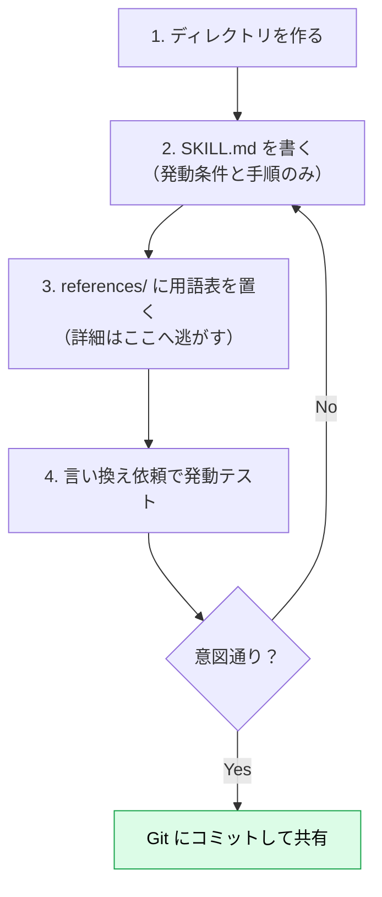

# 実践1：社内用語集 Skill を作る

> **この記事でわかること**：最も小さく効果が見えやすい Skill として「社内用語集」を、ディレクトリ作成から動作確認まで通しで作る手順。`references/` の分け方も押さえる。

## 結論

最初の Skill は **「テキスト資料だけで完結するもの」** から始めるのがよい。用語集はその典型で、次の3ファイルで動く。

- `SKILL.md`：発動条件と使い方（50行程度）
- `references/terms.md`：正式名称・略称・説明の対応表
- `references/forbidden.md`：使ってはいけない表現と言い換え

用語集は **CLAUDE.md に書くと常時ロードされて重く、毎回貼るには面倒** という、Skill 向きの題材である。

## 背景・課題

社内には「正式名称」「略称」「使ってはいけない呼び方」が混在する。AI はそれを知らないため、次のようなずれが起きる。

| 起きること | 例 |
| --- | --- |
| 略称を勝手に展開する | 社内では「SRE 基盤」だが「サイト信頼性エンジニアリング基盤」と書く |
| 表記が揺れる | 「ログイン / サインイン / ログオン」が混在 |
| 非推奨語を使う | 社外向け資料に旧プロダクト名が残る |

> 以下の用語は説明用の架空データである。実際の運用では自社の用語に置き換える。

## 具体的な方法

### 全体像



### 1. ディレクトリを作る

```bash
mkdir -p .claude/skills/company-glossary/references
```

### 2. SKILL.md を書く

`.claude/skills/company-glossary/SKILL.md`

```markdown
---
name: company-glossary
description: >-
  社内用語集に沿って表記を統一し、禁止表現を検出する。
  社外向け文書・README・リリースノート・仕様書を書く／レビューするとき、
  および「用語」「表記ゆれ」「言い換え」「NG ワード」に言及されたときに使う。
  コードの実装やバグ修正には使わない。
---

# 社内用語集

## 手順

1. **対象読者（社内向け／社外向け）を確認する。** 不明なら利用者に聞く
2. 文書中に登場する製品名・機能名・略語を洗い出す
3. `references/terms.md` を読み、**読者に応じた正式名称・略称の使い分け**に従う
4. `references/forbidden.md` を読み、禁止表現が含まれていれば言い換える
5. 用語集に**載っていない**新しい用語は、勝手に決めず利用者に確認する

## 出力ルール

- 初出は「正式名称（略称）」、2回目以降は略称
- **コードブロック・識別子（`signIn()` など）・URL・他社製品の固有表記・引用は書き換えない**
- 変更した箇所は、最後に「元の表記 → 修正後」の表で列挙する

## 資料

- 用語の対応表 → `references/terms.md`
- 禁止表現と言い換え → `references/forbidden.md`
```

ポイントは3つある。

| ポイント | 理由 |
| --- | --- |
| 本文は **手順と出力ルールだけ** | 用語そのものは `references/` に置き、必要なときだけ読ませる |
| **読者別の判断と対象外**を書く | 「一律に置換」は、コードや他社表記を壊す |
| **「載っていない用語は確認する」** と明記 | 用語集にない語を AI が推測で補うのを防ぐ |
| **「使わない場面」** を description に含める | コード作業で誤発動させない |

### 3. references/ に用語表を置く

`references/terms.md`

```markdown
# 用語表

| 正式名称 | 略称 | 説明 | 備考 |
|---|---|---|---|
| 統合認証基盤 | IAP | 全社共通のログイン基盤 | 社外向けは「アカウント基盤」 |
| 開発者ポータル | DevPortal | API ドキュメントの公開サイト | — |
| 変更管理委員会 | CAB | 本番変更の承認を行う会議体 | 社外向けには出さない |
```

`references/forbidden.md`

```markdown
# 禁止表現と言い換え

| 禁止 | 推奨 | 理由 |
|---|---|---|
| サインイン / ログオン | ログイン | 表記を統一 |
| 旧プロダクト名「Aster」 | 開発者ポータル | 名称変更済み。**移行・経緯の文脈は「開発者ポータル（旧 Aster）」と併記する** |
| 「〜させていただく」の連発 | 「〜する」 | 社外文書で冗長になる |
```

> 用語表が数百行になるときは、**ドメイン別に分割**する（`references/product.md` / `references/hr.md` など）。SKILL.md から「製品名の話なら `product.md`」と誘導すれば、関係ない分は読み込まれない。

### 4. 動作確認

新しいセッションで、Skill 名を**出さずに**依頼する。

```text
リリースノートの下書きを書いて。
「サインインの高速化」と「Aster のデータ移行」の2点を載せて。
```

期待する動き：

| 確認項目 | OK の状態 |
| --- | --- |
| 発動したか | company-glossary が読み込まれた旨が表示される |
| 読者を確認したか | 社内向けか社外向けかを尋ねている |
| 表記が直ったか | 「サインイン」→「ログイン」、「Aster」→「開発者ポータル（旧 Aster）」 |
| 未知語を確認したか | 用語集にない語を勝手に決めていない |

発動しないときは [`05_testing-troubleshooting.md`](05_testing-troubleshooting.md) の切り分け手順へ進む。

## 実際のプロンプト例

```text
# 既存資料から用語集の草案を作らせる
docs/ 配下の Markdown を読んで、頻出する固有名詞・略語・製品名を抽出し、
references/terms.md 形式（正式名称 / 略称 / 説明 / 備考）の表にして。
表記が揺れているものは、揺れの一覧も別表で出して。
確定はしないで、私が確認できるよう「要確認」列を付けて。

# Skill の生成を依頼する
上の表を元に、.claude/skills/company-glossary/ を作って。
SKILL.md は50行以内、詳細は references/ に分けて。
description は「何をするか / いつ使うか / トリガー語 / 使わない場面」を含めて。

# 動作確認
（別の新しいセッションで）company-glossary を使わずに、同じ依頼をやってみて。
使った場合の出力と比べた差分を表にして。
```

## 注意点

> **用語集は「鮮度」が命。** 名称変更が反映されないと、古い表記を推奨し続ける。更新担当と更新のタイミングを決めておく。

> **機密性の高い用語をそのまま Skill に書かない。** `.claude/skills/` は Git で共有される。社外秘の用語は、共有範囲を確認してから入れる。

> **機械で検出できる表記ゆれは、既存ツールに任せる。** textlint と辞書（prh）などを CI に置き、Skill は「読者別の言い換え」など文脈判断が要る部分に絞る。

> **最初から網羅しない。** まず「よく間違える20語」だけで始め、間違いが出るたびに足す。最初から数百語を入れると、検証できないまま肥大化する。

## 参考リンク

- [Claude Code Skillsに入門しよう！（Zenn）— 実践1：社内用語集スキル](https://zenn.dev/jackpotjack/articles/30de567059dd19)
- 前：[`02_writing-description.md`](02_writing-description.md) / 次：[`04_practice-ui-guidelines.md`](04_practice-ui-guidelines.md)
