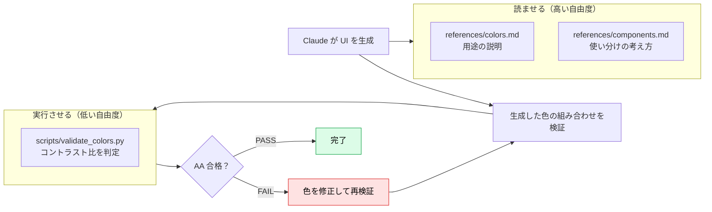

# 実践2：UI ガイドライン Skill とスクリプトによる検証

> **この記事でわかること**：文章の規約だけでは徹底しきれないルールを、`scripts/` の検証コードで担保する方法。デザインガイドラインを題材に、「読ませる資料」と「実行させる検証」を分ける設計を学ぶ。

## 結論

「配色はガイドラインに従うこと」と文章で書いても、AI は **守っているように見えて、実際には違反することがある**。守らせたいルールのうち、**機械で判定できるものは `scripts/` に検証コードとして実装する**。

| 種別 | 置き場所 | 例 |
| --- | --- | --- |
| 判断が要る規約 | `SKILL.md` / `references/` | トーン、余白の考え方、コンポーネントの使い分け |
| 数値で判定できる規約 | **`scripts/`（実行）** | コントラスト比、フォントサイズの下限（パレット照合も同様に実装できる） |
| 成果物の雛形 | `assets/` | トークン定義（JSON）、テンプレート |

文章は「Claude への指示」、スクリプトは「Claude の出力への検査」である。**指示だけでなく検査も用意する**と、品質が安定する。

## 背景・課題

デザインガイドラインには「文章では曖昧で、数値では明確」なルールが多い。

| ルール | 文章で書くと | 数値で書くと |
| --- | --- | --- |
| 文字は読みやすく | 曖昧 | 本文と背景のコントラスト比 **4.5:1 以上**（WCAG AA） |
| 色は統一する | 曖昧 | 使用色は `tokens.json` のパレット内のみ |
| ボタンは押しやすく | 曖昧 | 高さ 40px 以上（自社ルールの例） |

後者は **Claude に判断させず、コードに判定させる**ほうが確実である。

## 具体的な方法

### 構成

```text
ui-design-guidelines/
├── SKILL.md
├── references/
│   ├── colors.md          # カラーパレットと用途（表）
│   ├── typography.md      # フォントサイズ・行間
│   └── components.md      # ボタン等のサイズ・状態
├── scripts/
│   └── validate_colors.py # コントラスト比の検証
└── assets/
    └── tokens.json        # デザイントークン
```

### 設計の分担



**壊れやすい操作・一貫性が要る操作ほど、自由度を下げる**（決まったスクリプトを、決まった引数で実行させる）。一方、判断が要る部分は文章による指示に任せる。

### SKILL.md

```markdown
---
name: ui-design-guidelines
description: >-
  自社のデザインガイドライン（配色・タイポグラフィ・コンポーネント）に沿って UI を実装・レビューする。
  画面・コンポーネント・CSS・スタイルの実装やレビュー、「配色」「色」「フォント」「ボタン」
  「アクセシビリティ」「コントラスト」に言及されたときに使う。バックエンドの実装には使わない。
---

# UI デザインガイドライン

## 手順

1. 配色は `references/colors.md` のパレットから選ぶ（**パレット外の色は使わない**）
2. 文字サイズ・行間は `references/typography.md` に従う
3. ボタン等は `references/components.md` のサイズ・状態定義に従う
4. **文字色と背景色の組み合わせは、必ず検証する**（下記）
5. 検証が FAIL なら色を修正し、PASS するまで繰り返す

## 検証（必須）

文字色と背景色の組み合わせごとに、次を**実行**する（読むのではなく実行）。

    python3 "${CLAUDE_SKILL_DIR}/scripts/validate_colors.py" "<文字色HEX>" "<背景HEX>"

- **HEX は必ず引用符で囲む**（`#` 以降がシェルのコメントになり、引数が消える）
- 大きい文字（24px 以上、または 18.66px 以上の太字）は `--large` を付ける
- 終了コード 0 = AA 合格 / 1 = 不合格 / 2 = 入力エラー
- **FAIL のまま完了としない**

## 資料

- 配色 → `references/colors.md`
- タイポグラフィ → `references/typography.md`
- コンポーネント → `references/components.md`
- トークン定義（機械可読）→ `assets/tokens.json`
```

> `${CLAUDE_SKILL_DIR}` は、この Skill のディレクトリに置き換わる Claude Code の置換変数である。Claude Code 以外（claude.ai・API）では使えないため、`scripts/validate_colors.py` と書く。

### references/colors.md

```markdown
# カラーパレット

| 役割 | トークン | HEX | 用途 |
|---|---|---|---|
| プライマリ | `--color-primary` | #2563eb | 主要ボタン、リンク |
| セカンダリ | `--color-secondary` | #475569 | 補助ボタン、枠線 |
| 本文 | `--color-text` | #1a1a1a | 本文テキスト |
| 背景 | `--color-bg` | #ffffff | ページ背景 |
| エラー | `--color-error` | #dc2626 | エラー表示（**色だけで伝えず、アイコンも併用**） |
```

こうした対応表は、文章で書くより **表にしたほうが AI も人も誤読しにくい**。

### scripts/validate_colors.py

WCAG 2.x の相対輝度からコントラスト比を計算し、AA 基準（通常 4.5:1 / 大きい文字 3:1）を判定する。**標準ライブラリのみ**で動作する。全文は [`_assets/validate_colors.py`](_assets/validate_colors.py) に置いてある。核心部分は次の通り（抜粋のため単体では動かない）。

```python
def luminance(rgb):
    def channel(c):
        s = c / 255
        return s / 12.92 if s <= 0.03928 else ((s + 0.055) / 1.055) ** 2.4
    r, g, b = (channel(c) for c in rgb)
    return 0.2126 * r + 0.7152 * g + 0.0722 * b


def contrast(fg, bg):
    l1, l2 = luminance(parse_hex(fg)), luminance(parse_hex(bg))
    hi, lo = max(l1, l2), min(l1, l2)
    return (hi + 0.05) / (lo + 0.05)


# 判定：通常 4.5:1 / 大きい文字 3:1。FAIL なら「次にすべきこと」を出力して終了コード 1
if ratio < aa:
    print("→ 前景色を暗く、または背景色を明るくして再検証すること")
    sys.exit(1)
```

実行例（手元で確認した値。表示は切り捨て）：

| 呼び出し | 結果 |
| --- | --- |
| `validate_colors.py "#1a1a1a" "#ffffff"` | 17.40:1 → AA / AAA とも PASS |
| `validate_colors.py "#2563eb" "#ffffff"` | 5.16:1 → AA PASS / AAA FAIL |
| `validate_colors.py "#999" "#fff"` | 2.84:1 → **FAIL**（終了コード 1） |

#### スクリプトを Skill に入れるときの作法

| 作法 | 理由 |
| --- | --- |
| **エラーを握りつぶさず、次の行動を示す** | 「前景色を暗くして再検証」のように出力に書けば、Claude がそのまま修正に移れる |
| **入力エラーは終了コードで区別する** | 「不合格」と「呼び出し方が間違っている」を混同させない |
| **SKILL.md で「実行」と明記する** | 読み込んでしまうと、コードがコンテキストに入るだけになる |

## 実際のプロンプト例

```text
# Skill の骨格を作らせる
自社デザインシステムの資料（docs/design/）を読んで、
.claude/skills/ui-design-guidelines/ を作って。
- 判断が要る規約は references/ に表形式で
- 数値で判定できるもの（コントラスト比・許可パレット）は scripts/ に検証コードとして
- SKILL.md は「実行して検証する」手順を必須にして
description は「何をするか / いつ使うか / トリガー語 / 使わない場面」を含めて。

# 動作確認
ログイン画面のコンポーネントを実装して。
色を決めたら、ui-design-guidelines の検証スクリプトを実行して結果を見せて。
FAIL があれば直して、PASS するまで繰り返して。

# トークンの一括検査
assets/tokens.json の文字色トークンと背景色トークンの全組み合わせに
検証スクリプトを実行し、FAIL の一覧を表にして。
（描画後の画面全体は axe や Lighthouse など既存ツールで確認する）
```

## 注意点

> **スクリプトは「実行できる環境」でしか使えない。** claude.ai は設定によりネットワークやパッケージ導入に制限があり、API はネットワーク・追加インストールとも不可。標準ライブラリだけで書くのが無難である（→ [`07_distribution.md`](07_distribution.md)）。

> **人間がスクリプトの中身を読んでから入れる。** Skill 内のコードは Claude が実行する。他人の Skill のスクリプトは、ソフトウェアを導入するのと同じ注意で監査する。

> **コントラスト検証は文字色のみが対象である（WCAG 1.4.3）。** 枠線・アイコンの 3:1（1.4.11）、透過色、`rgb()` / 8桁 HEX は対象外で、入力エラーになる。キーボード操作なども別途確認する。

> **数値ルールは「1か所」に置く。** 本例では `tokens.json` を正とし、`colors.md` は人が読むための写しにする。別々に更新すると矛盾する。

## 参考リンク

- [Claude Code Skillsに入門しよう！（Zenn）— 実践2：UI デザインガイドライン](https://zenn.dev/jackpotjack/articles/30de567059dd19)
- [Skill authoring best practices — Advanced: Skills with executable code](https://platform.claude.com/docs/en/agents-and-tools/agent-skills/best-practices)
- [WCAG 2.x — Contrast (Minimum)](https://www.w3.org/WAI/WCAG22/Understanding/contrast-minimum.html)
- 前：[`03_practice-glossary.md`](03_practice-glossary.md) / 次：[`05_testing-troubleshooting.md`](05_testing-troubleshooting.md)
