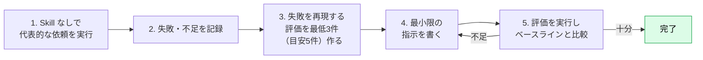
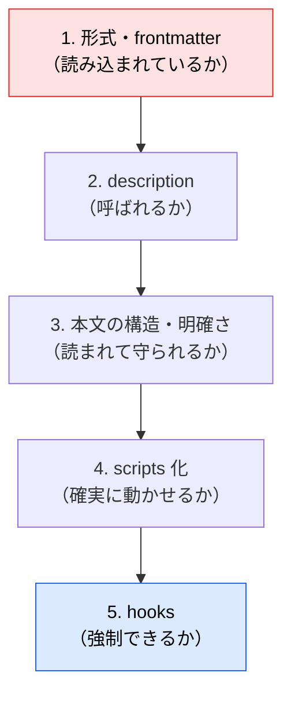

# Skills のテストとトラブルシューティング

> **この記事でわかること**：作った Skill が「本当に効いているか」を確かめる3種のテストと、呼ばれない・呼ばれすぎる・守られないときの切り分け手順。

## 結論

Skill は **書いた時点では未完成** である。次の順で確かめる。

1. **発動テスト**：狙った依頼で呼ばれるか（description の検証）
2. **機能テスト**：呼ばれたあと正しく動くか（本文・スクリプトの検証）
3. **比較テスト**：Skill ありのほうが、なしより良いか（存在意義の検証）

そして、**Skill を育てる段階では、評価を本文より先に作る**。「想像した課題」ではなく「実際に起きた失敗」に対して書くためである。最初の1本は、書いてから試してよい。

## 背景・課題

Skill の失敗は静かに起きる。エラーは出ず、ただ**読まれないか、読まれても守られない**。

| 失敗の型 | 見え方 |
| --- | --- |
| **不発** | 関連する依頼なのに Skill が使われない |
| **誤発動** | 無関係な依頼で Skill が読み込まれる |
| **無視** | 読まれたのに、指示が守られない |
| **形骸化** | Skill があってもなくても結果が同じ |

## 具体的な方法

### 評価駆動で作る



評価は表でも JSON でもよい。**期待する動作を複数の観点で書く**のがコツである。

```json
{
  "skill": "company-glossary",
  "query": "リリースノートの下書きを書いて。「サインインの高速化」を載せて",
  "expected_behavior": [
    "company-glossary が読み込まれる",
    "「サインイン」が「ログイン」に統一される",
    "用語集にない語を勝手に決めず、確認している"
  ]
}
```

> 公式ドキュメントも「評価を先に作る」ことを推奨している。ただし、筆者が確認した範囲（2026年9月時点）では**評価を自動実行する標準の仕組みは見当たらない**。チェックリストや簡単なスクリプトを自分で用意し、リポジトリで管理する（→ [`08_security-governance.md`](08_security-governance.md)）。

### 3種のテスト

| テスト | 確認すること | 方法 | 合格の目安 |
| --- | --- | --- | --- |
| **発動テスト** | 狙った依頼で呼ばれるか | 言い換えた依頼を10本前後投げる | 10本中**9本以上**で発動（3回繰り返しても安定） |
| | 無関係な依頼で呼ばれないか | 紛らわしい依頼を5本前後投げる | 5本中**誤発動0** |
| **機能テスト** | 手順通りに動くか | 代表的な依頼を実行し、出力を評価と照らす | 期待する動作を全て満たす |
| | 例外・欠損に耐えるか | 資料が空・入力が不正な場合を試す | 推測で埋めず、確認や停止をする |
| **比較テスト** | Skill が効いているか | 同じ依頼を Skill あり／なしで実行 | 差が出る（出ないなら Skill は不要か、内容が弱い） |

比較テストでは、**出力の質に加えて、往復回数や所要時間**も見る。Skill でやり取りが減っているなら、それが価値である。

### 発動テストの作り方

Skill 名を出さずに、**普段の言い回しで**頼む。

```text
# 発動すべき（言い回しを変える）
リリースノートを書いて
この README の表記ゆれを直して
社外向けの資料にしたいので言葉を揃えて

# 発動すべきでない（紛らわしいが対象外）
用語集の対応表を CSV に変換するスクリプトを書いて
このバグを直して
```

### モデルごとに試す

Skill はモデルへの「追加」であり、効き方はモデルで変わる。**使う予定の全モデルで試す**。

| モデル | 確認する観点 |
| --- | --- |
| Haiku 4.5 | 指示が十分か。省略すると意図を汲み取れないことがある |
| Sonnet 5 | 明確で効率的か |
| Opus 5 | 説明過多になっていないか。不要な説明は削る |
| Fable 5 | 最難度の作業で使う場合のみ追加で試す |

### 実運用の反復サイクル


Skill を書く・直す会話（以下 Claude A）と、実際に使う新しい会話（Claude B）を**分ける**と、実際の挙動に基づいて直せる。

| 観察すること | 意味 |
| --- | --- |
| 想定外の順序でファイルを読む | 構造が直感的でない |
| 参照先を読まない | リンクが目立たない。SKILL.md に要点を出すか、誘導を強める |
| 同じファイルを何度も読む | その内容は SKILL.md 本文に入れたほうがよい |
| 一度も読まれないファイル | 不要か、存在が伝わっていない |

### 症状別の切り分け

| 症状 | まず疑うこと | 対処 |
| --- | --- | --- |
| **一覧に出ない** | 形式：`<name>/SKILL.md` になっているか。フラットな `.md` は Skill ではない | ディレクトリ + `SKILL.md` に直す |
| | frontmatter：YAML が壊れていないか | `---` の位置、引用符、インデントを確認。Claude Code の `/skills` で一覧とエラーを確認（表示は版により異なる） |
| | 予約語・同名：`name` が重複・予約語でないか | 別名にする。優先順位（Enterprise > Personal > Project）で上書きされていないか確認 |
| | 起動時の監視：セッション開始後に新規のトップレベルを作った | セッションを再起動する |
| **不発** | description に「いつ使うか」・トリガー語があるか | [`02_writing-description.md`](02_writing-description.md) に従って書き直す |
| | `disable-model-invocation: true` になっていないか | 自動発動させたいなら外す |
| | `paths` の glob が編集中のファイルに合っているか | パターンを緩める |
| **誤発動** | description が抽象的すぎないか | 具体化し、「使わない場面」を足す |
| | 似た Skill と競合していないか | 説明を差別化する |
| **無視される** | 本文が長く、重要な指示が埋もれていないか | 重要事項を冒頭に。500行以内に収める |
| | 指示が曖昧（「適切に」「なるべく」） | 具体的な基準・手順に書き換える |
| | 決まった処理を文章で指示していないか | `scripts/` に落とし、実行させる |
| | 破られると困るルールか | **hooks で強制する**（→ [`../01_claude-code/06_hooks.md`](../01_claude-code/06_hooks.md)） |
| **引数が渡らない** | 本文に `$ARGUMENTS` 等のプレースホルダがあるか | なければ末尾に引数が追記されるだけになる |
| **スクリプトが動かない** | 実行権限・パス・依存が正しいか | `${CLAUDE_SKILL_DIR}` で絶対的に指定。標準ライブラリに寄せる |
| **参照資料が不完全に読まれる** | 参照が2階層以上になっていないか | SKILL.md から全資料を直接リンクする |
| **長い会話の途中で効かなくなる** | 自動圧縮（compaction）で Skill の内容が落ちた | 再度呼び出す。本文を短くする |

> Claude Code は、会話の圧縮時に**最近使った Skill の冒頭部分を優先的に残す**（公式記載：Skill あたり先頭5,000トークン・全体で25,000トークンの予算）。**重要な指示は本文の冒頭に置く**と、圧縮後も残りやすい。

### 修正の優先順位

効果が大きく、直しやすい順に手を付ける。



## 実際のプロンプト例

```text
# 不発の原因を探らせる
私が「リリースノートを書いて」と頼んだのに company-glossary が使われなかった。
次の順で原因を調べて、可能性が高い順に挙げて。
1. .claude/skills/company-glossary/ の形式（SKILL.md の位置・frontmatter の構文）
2. description の内容と、私の依頼文とのずれ
3. 同名・類似の Skill、disable-model-invocation、paths の設定
修正案は差分で見せて。まだ適用しないで。

# 評価を作らせる
ui-design-guidelines Skill について、評価を最低3件（目安5件）作って。
各件は「依頼文 / 期待する動作（3点）/ 失敗と判断する条件」で。
うち2件は「Skill を使わなければ失敗しやすいもの」にして。

# Skill あり／なしの比較
同じ依頼を、Skill を使わない場合と使う場合で実行して。
出力の差、往復回数、所要時間を表にして。差が小さければ、その理由も考察して。
```

## 注意点

> **モデルの更新や description の変更で発動率は変わる。** 評価はリポジトリで管理し、変更のたびに再実行する。

> **1回の成功で「動いた」と判断しない。** 言い回しを変えて複数回試す。発動は確率的で、たまたま呼ばれただけの場合がある。

> **Skill を直したら、必ず新しいセッションで試す。** 編集は再起動なしで反映されるが、同じ会話では前の指示や文脈が残って結果が汚れる。

> **本文を厚くする前に、description と構造を疑う。** 「守られない」原因の多くは、指示の不足ではなく、読まれていないか、埋もれていることである。

> **比較テストで差が出なければ、その Skill は不要かもしれない。** Claude が既に知っていることを書いた Skill は、コンテキストを消費するだけである。削る勇気を持つ。

## 参考リンク

- [Skill authoring best practices — Evaluation and iteration](https://platform.claude.com/docs/en/agents-and-tools/agent-skills/best-practices)
- [Use Skills in Claude Code — Troubleshooting](https://code.claude.com/docs/en/skills)
- [Claude Code Skillsに入門しよう！（Zenn）— テスト方法・トラブルシューティング](https://zenn.dev/jackpotjack/articles/30de567059dd19)
- 前：[`04_practice-ui-guidelines.md`](04_practice-ui-guidelines.md) / 次：[`06_invocation-control.md`](06_invocation-control.md)
