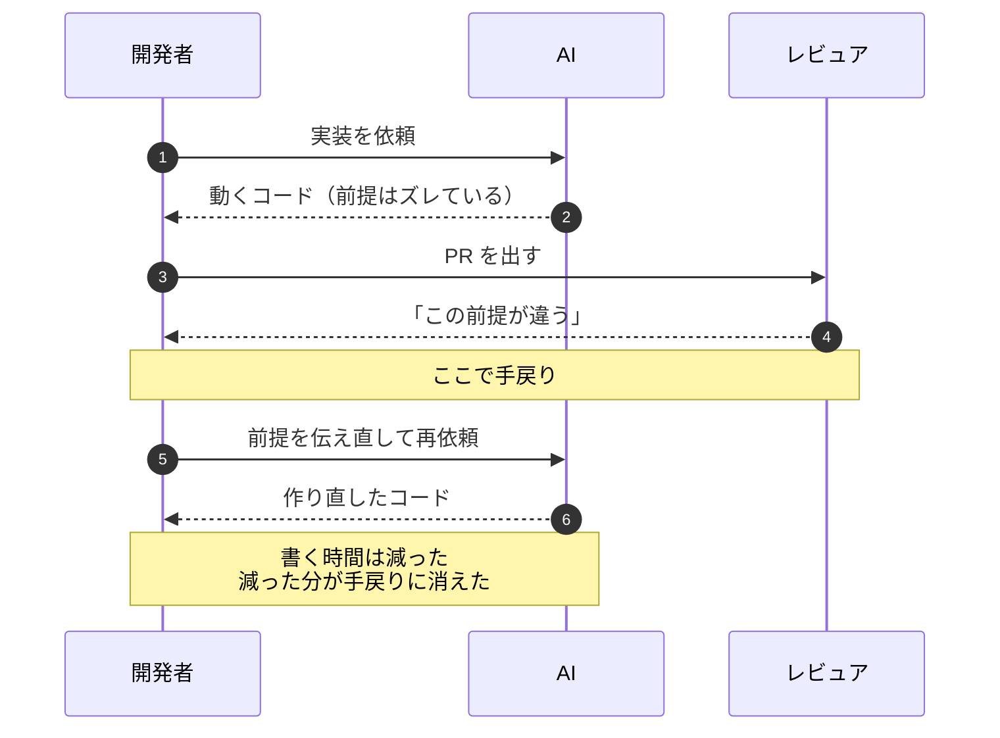
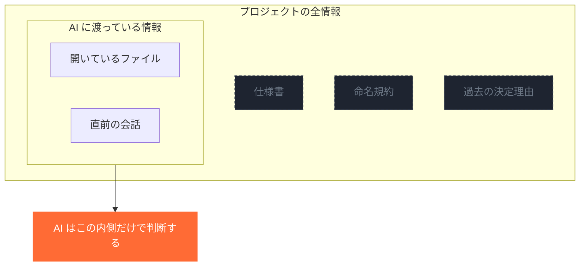
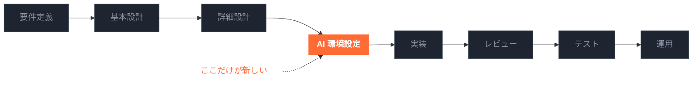
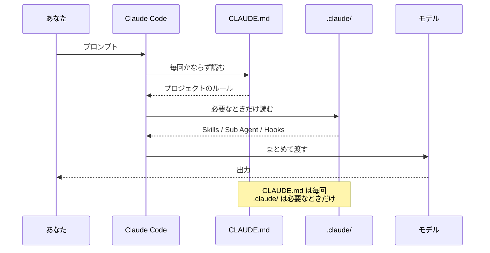
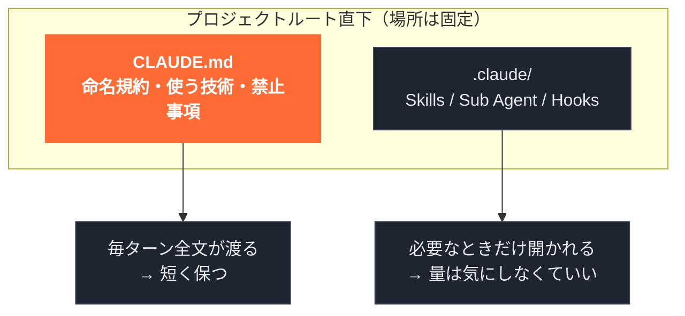
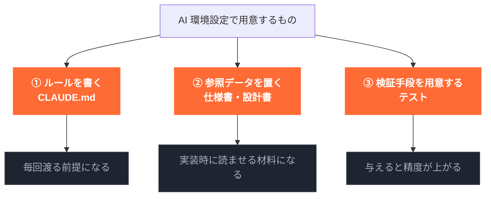
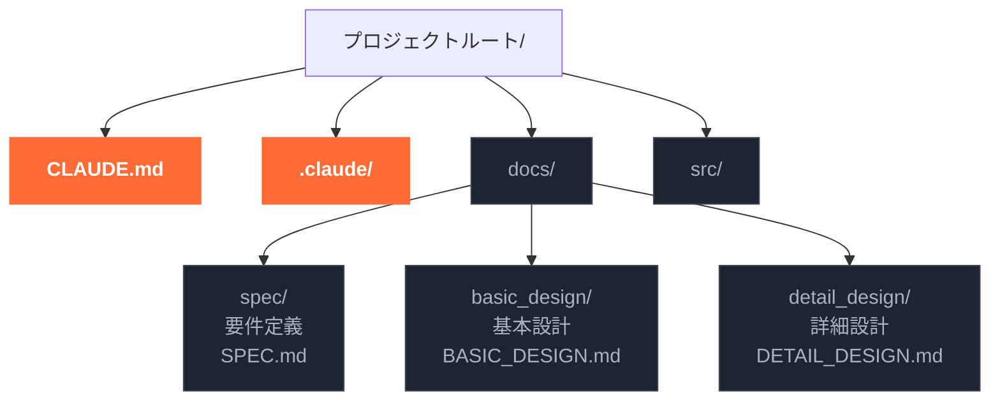
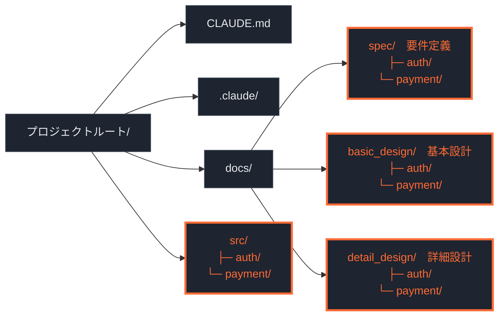
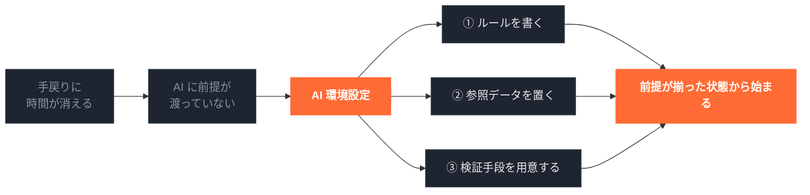

# AIに書かせる前にやること

<!-- 尺: 本編10枚。表紙10秒 + 各50秒 ≒ 約8分。図は9点で、Canva の asset_ids 上限10まで1枠空いている -->
<!-- 図: Mermaid 10点（Canva の asset_ids 上限ちょうど）。`./render-figures.sh 00_ai-env-setup` で _assets/ に書き出す -->

## 導入

### S01 ｜ AIに書かせる前にやること

`type: title` ｜ `visual: none`

AIに書かせる前にやること — 手戻りを減らす環境のつくりかた

<!-- note: 表紙。冒頭で「今日は基礎編です。skills や hooks の話はしません」と範囲を宣言する -->

## 1. 課題

### S02 ｜ 速くなった分が、手戻りに消える

`type: compare` ｜ `visual: mermaid`

書く時間は確かに減ります。減った分がそのまま手戻りに消えていく、という状態が起きます。

[figure: 手戻りが発生するまでのシーケンス]

<!-- note: 「速くならない」ではなく「手戻りに消える」と言い切る。ここで聞き手を当事者にする -->

## 2. 原因

### S03 ｜ AIは渡された情報しか見ていない

`type: message` ｜ `visual: mermaid`

AIはプロジェクトを見渡してはいません。渡された範囲だけで判断します。足りないのは性能ではなく、渡している情報のほうです。

[figure: AIに渡っている情報と、渡っていない情報]

<!-- note: ここが転換点。「もっと良いモデルを待つ」という発想を切る -->

## 3. 結論

### S04 ｜ 工程を1つ挟むだけでいい

`type: message` ｜ `visual: mermaid`

新しい方法論を覚え直す必要はありません。実装に入る前に、AIに渡すものを決める工程を1つ挟みます。

[figure: ★このデッキの主役。開発フロー全体と、増える1工程]

<!-- note: 一番時間を使うスライド。指で「ここだけ」と示す -->
<!-- note: ★「AI環境設定」は一般的な用語ではない。「この発表ではこう呼びます」と断ってから使う -->
<!-- note: 世の中では「コンテキストエンジニアリング」と呼ばれている領域だと補足すると位置づけが伝わる -->

## 4. AI環境設定とは

### S05 ｜ AIはどの順番で読んでいるか

`type: message` ｜ `visual: mermaid`

プロンプトを送った瞬間、AIはコードを見ていません。最初に読まれるのはプロジェクトのルールです。

[figure: プロンプトから出力までに何が読まれるか]

<!-- note: ★このスライドで「なぜ CLAUDE.md が効くのか」が腑に落ちる。急がない -->
<!-- note: 「コードを読むのはこのあと」と一言添える。最初の判断材料は CLAUDE.md だけ -->

### S06 ｜ CLAUDE.md と .claude/

`type: compare` ｜ `visual: mermaid`

ルート直下に置く2つです。片方は毎回読まれる指示書、もう片方は必要なときだけ開く道具箱です。

[figure: 2つのファイルの役割と、読まれるタイミング]

<!-- fig: CLAUDE.md を強調。「今日は CLAUDE.md まで」の範囲を示すため .claude/ は控えめに -->
<!-- note: 「.claude/ の中身は発展編で」と明示して深追いを避ける -->

## 5. 具体的にやること

### S07 ｜ 用意するのは3つ

`type: message` ｜ `visual: mermaid`

ルールを書く。AIが参照できるデータを置く。検証手段を用意する。この3つです。

[figure: AI環境設定で用意する3つ]

<!-- fig: ③ は断定しない。「必ず上がる」ではなく「上がる」トーンで -->
<!-- note: ②は「AIが実装時に参照できるデータを置く」と言う。仕様書を書くのはAIのためではないが、置き方は AI のために決める -->
<!-- note: ③は言い切らない。「絶対ではないが、検証手段を渡して実装させると精度が上がる」と言う -->

## 6. ディレクトリの例

### S08 ｜ 小規模の場合

`type: message` ｜ `visual: mermaid`

機能数が少ないうちは、この形で足ります。設計書は3種類、AI環境設定はルート直下に置きます。

[figure: 小規模プロジェクトのディレクトリ]

<!-- note: ★ファイル名は description に書かない。Canva のAIにリライトされて壊れる。必ず図で出す -->
<!-- note: 「AI環境設定は設計書ではないので docs/ の下に入れない」を口頭で言う -->

### S09 ｜ 大規模の場合

`type: message` ｜ `visual: mermaid`

機能が増えたら機能別に分けます。3種類の設計書すべてを同じように分け、実装のモジュール名と揃えます。

[figure: 大規模プロジェクトの全体構成。3種類とも機能別に分ける]

<!-- fig: オレンジ枠の4つで同じ名前（auth / payment）が並んでいることが見えればよい。枠線で揃え、塗りつぶさない -->
<!-- note: ★spec だけではない。基本設計も詳細設計も同じように分ける、と口頭で必ず言う -->
<!-- note: 「最初からこれを作らない。読み切れなくなってから分ける」と一言添える -->

## 7. まとめ

### S10 ｜ まとめ

`type: message` ｜ `visual: mermaid`

AIに最初に渡っているのはプロジェクトのルールだけです。そこを整える工程を1つ挟めば、前提が揃った状態から始められます。

[figure: 今日の流れの再掲。課題から打ち手まで1本の線にする]

<!-- note: 図の左から右へ指でなぞりながら話す。ここで新しい情報を足さない -->
