# Claude Code の5つの設定

<!-- 尺: 本編19枚。表紙10秒 + 各55秒 ≒ 約18分。12分に詰めるなら S08・S10・S12・S15・S18 を落とす -->
<!-- 図: Mermaid 11点（S12 が Before/After の2枚1組） + 手貼り3点（S03・S14・S15）。Appendix は手貼りのみ。`./render-figures.sh 01_claude-code` -->
<!-- ⚠️ Canva の asset_ids は10枚が上限。Canva 経由で流す場合は S05 か S18 を文字だけに落として10点に戻す。今回の配布は Claude Artifact のため上限の対象外 -->
<!-- 00_ai-env-setup を見ていない前提で成立させている。連続で話す場合は S02 を飛ばす -->
<!-- 言い換えや比喩は使わない方針。「憲法」「専門書」のような表現を入れない -->

## 導入

### S01 ｜ Claude Code の5つの設定

`type: title` ｜ `visual: none`

Claude Code の5つの設定 — CLAUDE.md / Skills / Sub Agent / Hooks / MCP

<!-- note: 表紙。「CLAUDE.md は書いたけど、その先を触っていない人向け」と対象を宣言する -->

## 1. CLAUDE.md

### S02 ｜ まず CLAUDE.md

`type: message` ｜ `visual: mermaid`

プロジェクトのルールを書いておくファイルです。命名規約、使う技術、やってほしくないこと。これがやりとりのたびに必ず渡されます。

[figure: プロンプトを送ってから出力が返るまでに CLAUDE.md が渡る]

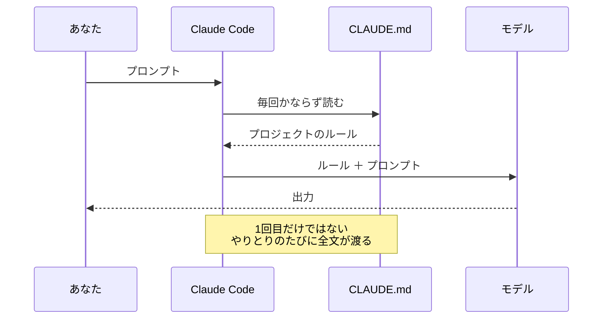

<!-- note: ★「毎回」を強調する。1回目だけ読まれるのではない -->
<!-- note: 「これを消したら AI は間違えるか？」で取捨する。No なら消す -->

### S03 ｜ CLAUDE.md の例

`type: demo` ｜ `visual: manual`

書くのは、このプロジェクトでしか通じないことだけです。とくに効くのは、そこでしか起きない落とし穴です。

[figure: manual — 以下をコードブロック風に Canva 上で手貼りする]
<!-- fig:
左「書くこと」：
    # 言語
    - 必ず日本語で回答する

    # 規約
    - パッケージマネージャは pnpm。npm / yarn は使わない
    - API の型は src/types/api.ts に置く。各所で再定義しない

    # 落とし穴（このプロジェクト特有）
    - src/generated/ は自動生成。手で編集しない
    - テストを動かす前に docker compose up が必要
    - 本番の環境変数名は .env.example と綴りが違う

右「書かないこと」（グレーで小さく）：
    ❌ React を使っています        → AI がもう知っている
    ❌ 現在のバージョンは v2.3.1    → すぐ変わる
    ❌ 障害対応の詳しい手順          → そのときしか使わない（Skills へ）
-->

<!-- note: ★一番効くのは「落とし穴」。一般的なベストプラクティスより、そこでしか起きない罠のほうが価値がある -->
<!-- note: 長さの目安は200〜300行。長いほど個々の指示は薄まる -->
<!-- note: ★Canva 上で手貼りする。自動生成に任せるとパス名やコマンドが書き換えられて壊れる -->

## 2. Skills

### S04 ｜ Skills とは何か

`type: message` ｜ `visual: none`

決まった手順をまとめておくファイルです。**手順をまとめておくことで、必要なときに呼び出して使うことができます。**

<!-- fig: 図は入れない。この1文だけを大きく置く -->
<!-- note: 「全タスクで要るか？ No なら Skills」という切り出し基準を口頭で言う -->
<!-- note: ★本文がどれだけ長くても、使わない間は渡らない。ここが CLAUDE.md との差。S06 の図でもう一度見せる -->

### S05 ｜ Skills の例

`type: demo` ｜ `visual: mermaid`

よく作られるのは、毎回同じ観点で見たいものです。観点を書いておけば、誰がやっても同じ深さになります。

[figure: よく作られる Skills]

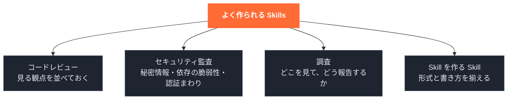

<!-- note: ★「Skill を作る Skill」は地味に効く。形式を間違えて動かない事故が減る -->
<!-- note: レビュー系が一番多い。観点を書いておくと、レビューの深さが人に依存しなくなる -->

### S06 ｜ CLAUDE.md と .claude/

`type: compare` ｜ `visual: mermaid`

紛らわしいですが別物です。違いは置き場所ではなく、読まれるタイミングです。

[figure: ★2つの読まれ方の違いと、.claude/ の中身]

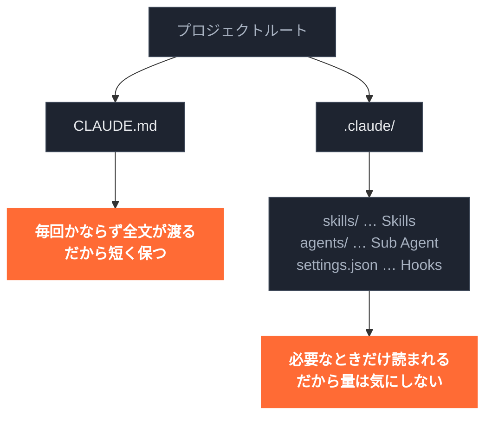

<!-- fig: 左右で「毎回」と「必要なときだけ」が対になって見えればよい -->
<!-- note: ★「CLAUDE.md に全部書けばいい」という誤解をここで潰す -->
<!-- note: agents/ と settings.json はこの後で説明する、と予告してから進む -->

## 3. Sub Agent

### S07 ｜ Sub Agent とは何か

`type: message` ｜ `visual: mermaid`

別の Claude を呼び出して働かせ、結果の要約だけを受け取る仕組みです。作業の過程は手元の会話に残りません。

[figure: 別のところで動いて、結果だけ返ってくる]

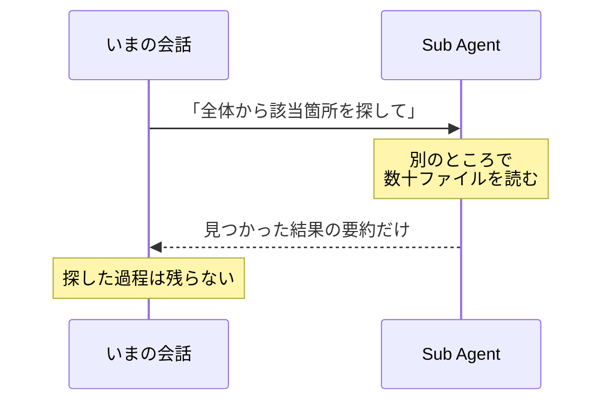

<!-- note: 別のウィンドウで作業させて、報告だけ受け取るイメージで話す -->

### S08 ｜ 何が嬉しいのか

`type: message` ｜ `visual: none`

- コンテキスト汚染を防ぐ — 各自がまっさらな会話で、必要な情報だけを持って動く
- 並行作業ができる — 「Aのあとに B」を「AとBを同時に」に変えられる
- 専門のタスクに集中させる — 調査役・テスト役・ドキュメント役と役割を分けられる

<!-- fig: 図は入れない。3行の箇条書きを大きく並べるだけ -->
<!-- note: ★一番効くのは1つ目。1つの会話で大量の作業をこなすと、会話が長くなり過去の文脈に引きずられる。Sub Agent は独立したまっさらな会話で動くので、これを避けられる -->
<!-- note: 並行作業は、大量のドキュメント解析・シーダー生成・本丸の実装など、時間のかかる作業で効く -->

### S09 ｜ Sub Agent の例

`type: demo` ｜ `visual: mermaid`

メインの Claude が作業を振り分け、役割ごとに別の Claude に任せます。それぞれ自分の担当に必要な情報だけを持って動きます。

[figure: メインから3つの Sub Agent に振り分ける]

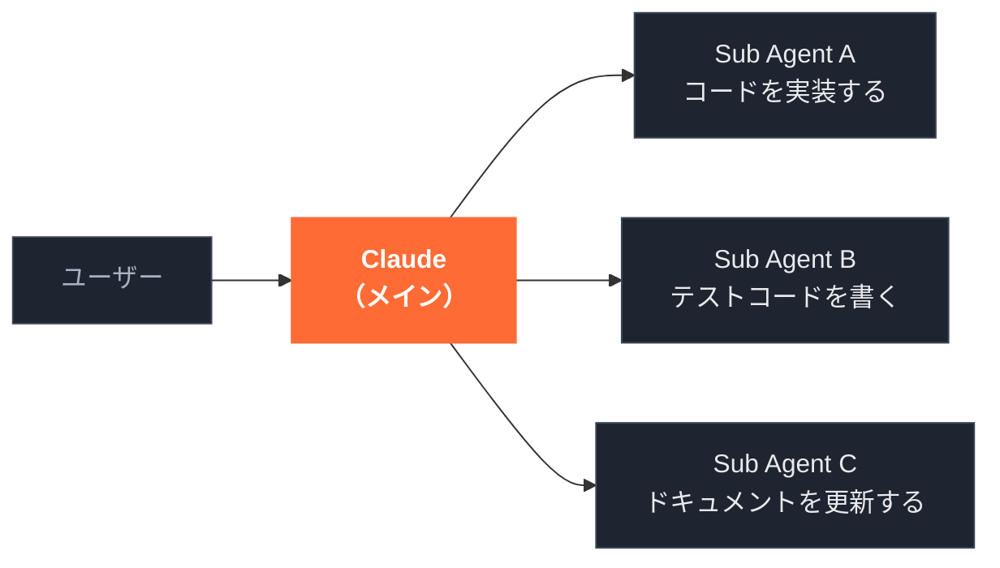

<!-- note: ユーザーが話すのはメインだけ。Sub Agent への振り分けと結果の取りまとめはメインがやる -->
<!-- note: 使えるツールも役割ごとに絞れる。たとえばレビュー役は読み取りだけ許可すると、勝手に直してしまうのを防げる -->

### S10 ｜ Sub Agent の注意点

`type: warn` ｜ `visual: none`

- コストが増える — それぞれが独立して動くので、立ち上げた数だけ費用がかさむ
- 会話は引き継がない — 「さっき決めた件」は通じない。必要な情報は明示的に渡す

<!-- fig: 図は入れない。2行の箇条書きを大きく並べるだけ -->
<!-- note: コストは立ち上げた数にほぼ比例して増える目安。「とりあえず全部 Sub Agent」ではなく、必要な場面で使う -->
<!-- note: ★2つ目が一番ハマる。メインで決めた前提を Sub Agent は知らないので、指示に書き込んで渡す -->
<!-- note: 8分に詰める場合は S08 とこの1枚を落とす -->

## 4. Hooks

### S11 ｜ Hooks とは何か

`type: message` ｜ `visual: mermaid`

Claude Code が何かをする前後に、自動で実行される処理です。これだけです。代表的なタイミングは3つあります。

[figure: ツール実行の前・後・停止時の3つのタイミング]

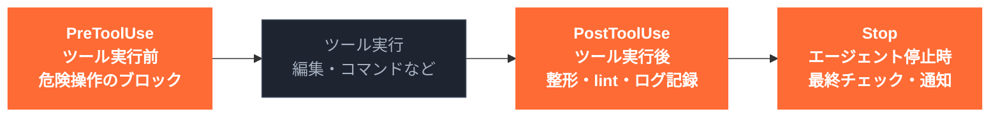

<!-- fig: フック名（PreToolUse など）は設定キーなので description に書かず、図の中にだけ置く -->
<!-- note: ★CLAUDE.md に「lint をかけて」と書いても、忘れられることがある。Hooks は忘れられない -->
<!-- note: タイミングは他にもある（Sub Agent 終了時・入力待ちの通知など）。今日はこの3つだけ覚えれば十分 -->

### S12 ｜ Hooks で手戻りが消える

`type: compare` ｜ `visual: mermaid`

導入前は、編集のたびに「フォーマットは？型は？」と言い直していました。導入後は、言わなくても毎回かかります。

[figure: ★左に Before（往復3回）、右に After（1回で終わる）を並べる]

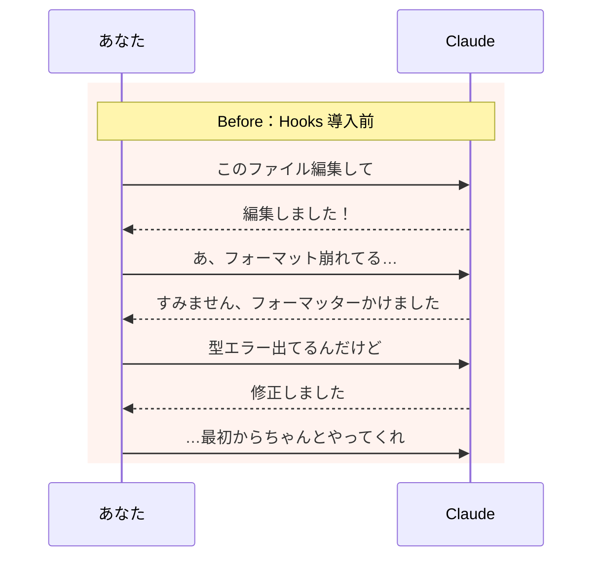

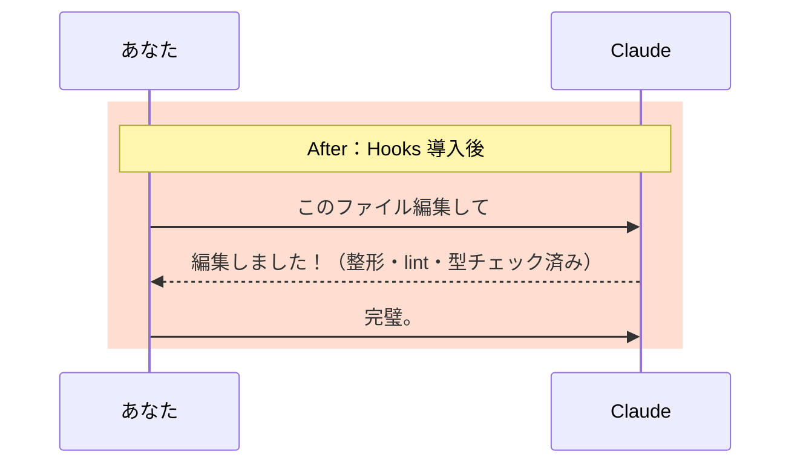

<!-- fig: 2点1組。左（Before）・右（After）で横に並べる。縦積みにしない -->
<!-- note: ★「この差、分かりますか？」と会場に問いかけてから次へ -->
<!-- note: 型チェックやテストのような重い処理は、編集のたびではなく停止時（Stop）に1回かけるほうが速い -->

### S13 ｜ 今すぐ使える Hooks 3選

`type: demo` ｜ `visual: none`

どれも「AIが忘れても必ず起きてほしいこと」です。設定ファイルに数行足すだけで入ります。

- 編集のあとに自動で整形する
- 危険なコマンドを止める
- 実行したコマンドを全部記録する

<!-- fig: 図は入れない。3行を大きく並べる。どのタイミングで動くかは S11 の図で説明済み -->
<!-- note: 1つ目が一番人気。次のスライドで実物を見せる。2つ目・3つ目の設定は Appendix A1・A2 -->
<!-- note: 2つ目は「本番で rm -rf されたら人生終わる」の一言で伝わる。ただし文字列マッチなので書き方を変えればすり抜ける。まず設定ファイルの禁止リスト（permissions）で止め、hook はその次の砦 -->
<!-- note: 3つ目は監査証跡にもデバッグにも使える。「Claude が何をしたか分からない」問題が消える -->

### S14 ｜ 例：編集後に自動で整形する

`type: demo` ｜ `visual: manual`

Claude がファイルを編集・作成するたびに、TypeScript のファイルなら自動で Prettier がかかります。「フォーマット忘れ」はもう起きません。

[figure: manual — 以下をコードブロック風に Canva 上で手貼りする]
<!-- fig:
タイトル下に小さく：.claude/settings.json

{
  "hooks": {
    "PostToolUse": [
      {
        "matcher": "Edit|Write",
        "hooks": [
          {
            "type": "command",
            "command": "jq -r '.tool_input.file_path' | grep -E '\\.tsx?$' | xargs -r npx prettier --write"
          }
        ]
      }
    ]
  }
}

右に吹き出しで3行：
  matcher      → 編集（Edit）か作成（Write）のたびに
  grep         → .ts / .tsx のときだけ
  prettier     → 自動で整形
-->

<!-- note: ★対象のファイル名は環境変数ではなく、標準入力の JSON で渡ってくる。それを jq で取り出している -->
<!-- note: ~/.claude/settings.json に書けば全プロジェクト、.claude/settings.json に書けばこのプロジェクトだけ。チームで共有するなら後者を commit する -->
<!-- note: ★Canva 上で手貼りする。自動生成に任せるとキー名や記号が書き換えられて壊れる -->

### S15 ｜ MCP のツールにもかけられる

`type: demo` ｜ `visual: manual`

Hooks は MCP のツールにも効きます。GitHub の MCP で push する前にテストを走らせ、落ちたら止める、ができます。

[figure: manual — 以下をコードブロック風に Canva 上で手貼りする]
<!-- fig:
{
  "hooks": {
    "PreToolUse": [
      {
        "matcher": "mcp__github__push_files",
        "hooks": [
          {
            "type": "command",
            "command": "npm test > /dev/null 2>&1 || { echo 'テストが通らないため push を止めました' >&2; exit 2; }"
          }
        ]
      }
    ]
  }
}

下に1行（オレンジ）：exit 2 で止まる。理由は Claude に伝わる
-->

<!-- note: ★MCP のツール名は「mcp__サーバー名__ツール名」。matcher にそのまま書ける -->
<!-- note: ★止めるのは exit 2。exit 1 では止まらない。ここを間違えると「保護したつもりで無防備」になる -->
<!-- note: これで止まるのは MCP 経由の push だけ。Bash から git push する経路は別なので、完全に塞ぐなら Bash 側にも同じ hook を置く -->
<!-- note: 詳しい書き方は Hooks 特化のデッキで扱う、と予告する -->

## 5. MCP

### S16 ｜ MCP とは何か

`type: message` ｜ `visual: mermaid`

AIを外部サービスに繋ぐための共通規格です。規格なので、Claude Code だけでなく他のAIツールからも同じ繋ぎ先をそのまま使えます。

[figure: ★左のAIツールはどれでも、同じ繋ぎ先を共通の規格で使える]

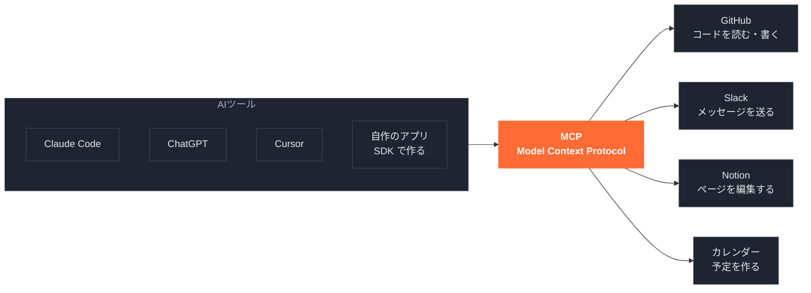

<!-- note: ★ここが今日いちばん言いたいところ。CLAUDE.md・Skills・Sub Agent・Hooks は Claude Code の機能だが、MCP だけは Claude Code の機能ではなく共通規格 -->
<!-- note: 繋ぎ先（MCP サーバー）は各サービス側や有志が公開していて、自分で書くこともできる -->
<!-- note: 自作アプリの話は、聞かれたら答える程度でよい。公式 SDK で MCP に繋ぐ側を実装できる（社内ツールから GitHub の繋ぎ先を使う、など）。逆に、社内APIを繋ぎ先として公開すれば Claude Code からも ChatGPT からも使える -->
<!-- note: 提唱は Anthropic だが、いまは中立の団体が管理していて、他社のAIツールも対応している -->

### S17 ｜ 参考：開発まわりの例

`type: demo` ｜ `visual: mermaid`

コード・API・DBまわりで繋がれています。それぞれ得意分野が違います。

[figure: 開発まわりでよく使われる MCP]

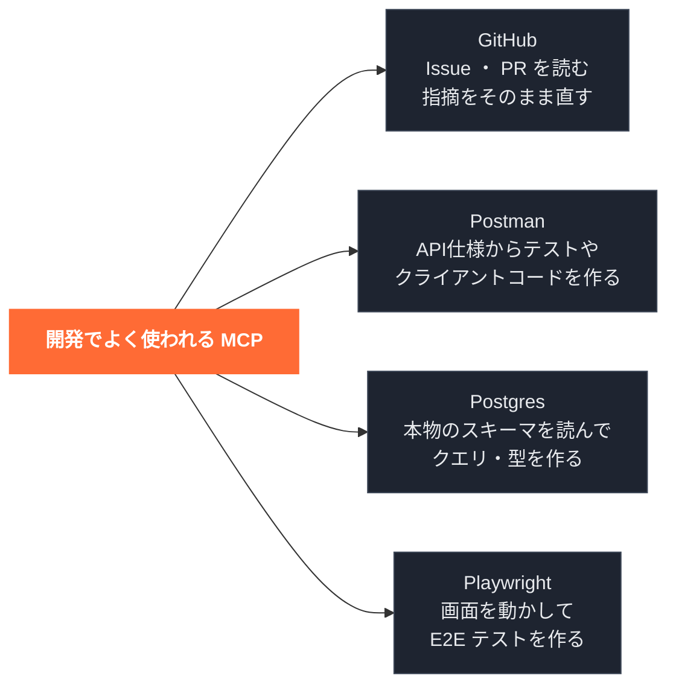

<!-- note: GitHub MCP。ただし単純な Issue 取得や PR 作成は gh コマンドのほうが速い。使い分けは記事に書いた -->
<!-- note: Postman MCP。自然文の指示を API 呼び出しに変換して、コレクションのテスト実行やクライアントコード生成までやる -->
<!-- note: Postgres MCP。AI が実在しないテーブル名を作ってしまう問題を、実スキーマ参照で潰す。★接続は読み取り専用に絞る -->
<!-- note: Playwright MCP。公式（Microsoft）。画面を実際に動かしてテストを書く。壊れたテストの自己修復もできる -->
<!-- note: どれか1つを推すスライドではない。自分の作業に近いものから触ってみる、と伝える -->
<!-- note: 具体的な設定手順は contents/02_mcp/ にカタログがある、と誘導する -->
<!-- note: ⚠️ Postman MCP は contents/02_mcp/ にまだ記事がない。公開前に執筆するか、このスライドの扱いを下げる -->

### S18 ｜ 参考②：情報・デザインの例

`type: demo` ｜ `visual: mermaid`

コードに残らない情報にも繋がります。デザインの値や、社内に眠っている資料・議論を渡せます。

[figure: 情報・デザインまわりでよく使われる MCP]

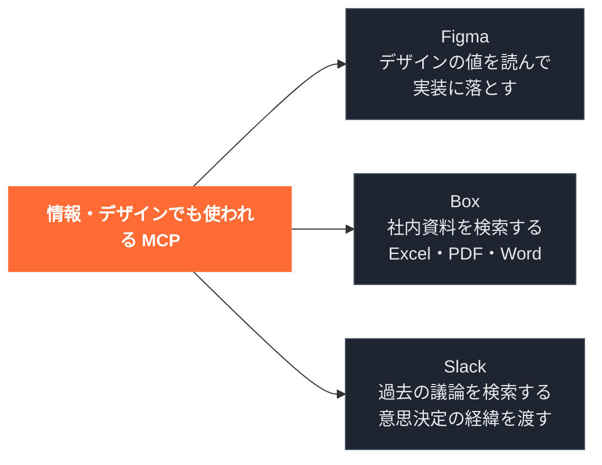

<!-- note: Figma MCP。成否は MCP の使い方より Figma ファイルの構造で決まる。命名や Auto Layout が崩れていると精度が落ちる -->
<!-- note: Box MCP。機密資料をローカルに落とさずに検索・要約できる -->
<!-- note: ★Slack MCP。読み取り専用で運用する。コードに残らない「なぜこうなっているか」の経緯が拾える -->
<!-- note: 入れすぎない。繋ぐほど起動が遅くなり、使えるツールの一覧だけでコンテキストを食う。使うものだけ繋ぐ -->
<!-- note: 外部サービスに繋ぐ＝データが外に出る経路ができる、でもある。会社の規程は先に確認する -->

## 6. まとめ

### S19 ｜ まとめ：5つの使い分け

`type: compare` ｜ `visual: none`

迷ったら、やりたいことから引いてください。担当が違うだけで、取り合いにはなりません。

- 毎回守ってほしいルールがある → **CLAUDE.md**
- 決まった手順を渡したい → **Skills**
- 別の役割で動かしたい → **Sub Agent**
- 忘れられたくない処理がある → **Hooks**
- 外のサービスを見に行きたい → **MCP**

<!-- fig: 図は入れない。5行を大きく並べるだけ。左右2列にすると読みづらいので縦1列 -->
<!-- note: ★この5行が言えれば、社内で聞かれたときに答えられる。ここを一番ゆっくり話す -->
<!-- note: 締めは「まずは Skills を1つ作ってみてください」と口頭で言う -->

## Appendix

### A1 ｜ 危険なコマンドを止める

`type: demo` ｜ `visual: manual`

Bash を実行する前にコマンドを確認し、危険なものならその場で止めます。AIが暴走しても、最後の砦になります。

[figure: manual — 以下をコードブロック風に Canva 上で手貼りする]
<!-- fig:
{
  "hooks": {
    "PreToolUse": [
      {
        "matcher": "Bash",
        "hooks": [
          {
            "type": "command",
            "command": "jq -r '.tool_input.command' | grep -qE 'rm -rf /|DROP TABLE' && { echo '危険なコマンドのためブロックしました' >&2; exit 2; } || true"
          }
        ]
      }
    ]
  }
}
-->

<!-- note: 文字列マッチなので、空白を増やす・別の書き方をするとすり抜ける。まず permissions の deny で止め、hook は二重の守り -->

### A2 ｜ 実行したコマンドを全部記録する

`type: demo` ｜ `visual: manual`

Claude が実行した Bash コマンドを、日時つきでログに残します。監査証跡にも、デバッグにも使えます。

[figure: manual — 以下をコードブロック風に Canva 上で手貼りする]
<!-- fig:
{
  "hooks": {
    "PostToolUse": [
      {
        "matcher": "Bash",
        "hooks": [
          {
            "type": "command",
            "command": "jq -r '(now | todate) + \" \" + .tool_input.command' >> ~/.claude/command_history.log"
          }
        ]
      }
    ]
  }
}
-->

<!-- note: 日時は UTC で記録される -->

### A3 ｜ MCP が動くまでの流れ

`type: demo` ｜ `visual: none`

質疑で「中で何が起きているのか」を聞かれたら開きます。

1. AIツールの起動時に、繋ぎ先から「使える機能の一覧」を受け取る
2. その一覧と、あなたのプロンプトをモデルに渡す
3. モデルが「この機能を使う」と判断して返す
4. 実行の前に、あなたに許可を聞く
5. 繋ぎ先が外部サービスを呼び、結果を受け取って回答を作る

<!-- note: ★勝手に実行されるわけではない。4の許可があるので、そこで止められる -->
<!-- note: 繋ぎ先には2通りある。手元のPCで動かすもの（ファイル操作など）と、提供元のサーバーに繋ぐもの（GitHub・Slack・Notion など）。後者は第三者にデータが渡るので、導入判断を分けて考える -->
<!-- note: 出典: https://zenn.dev/kazuwombat/articles/d8789724f10092 -->
